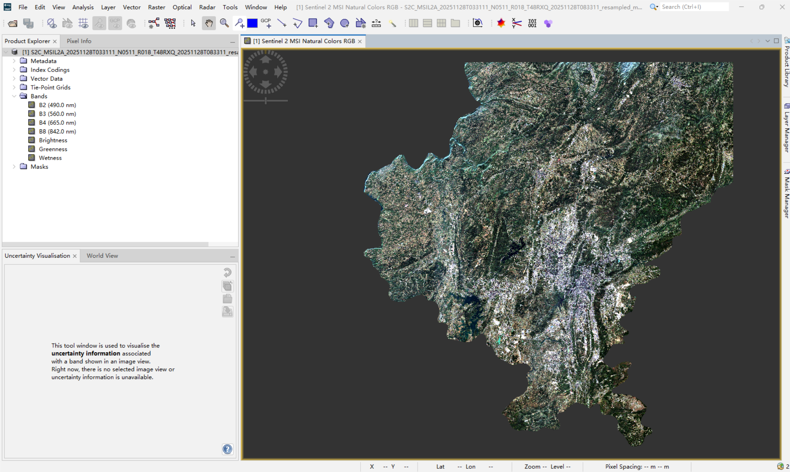
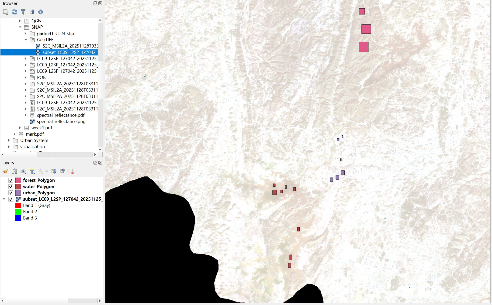
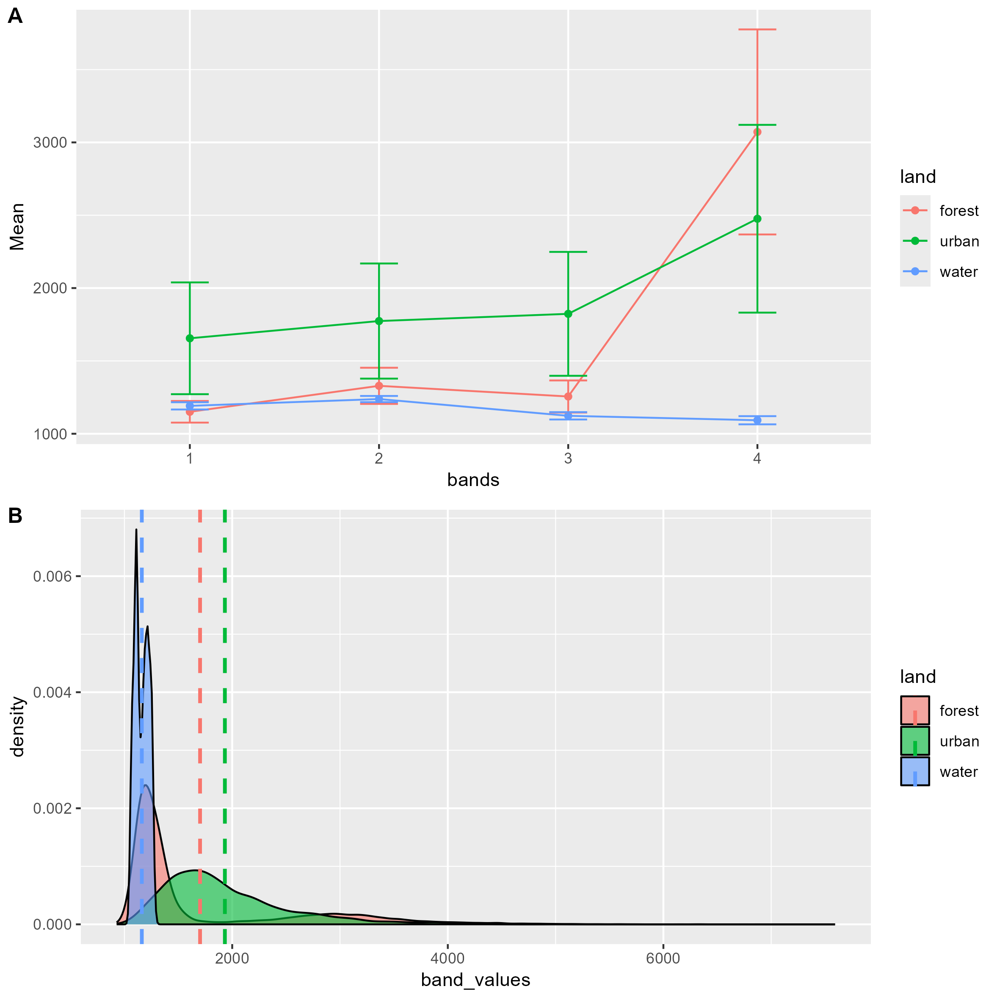
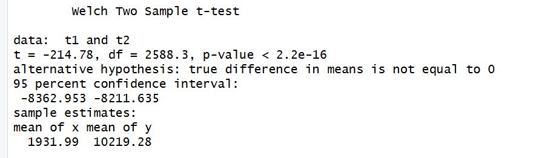

## 1. Content Summary

### 1.1 Physical Fundamentals of Remote Sensing & EMR
This week's learning made me realize that remote sensing is not simply photography, but rather the physical measurement of electromagnetic radiation (EMR) energy interactions [@brady2021]. Through the lecture, I grasped the core formula of electromagnetic waves: $\lambda = c/v$, where wavelength is inversely proportional to frequency.

::: {.callout-note}
Before the sensor detects the Earth's surface, the energy undergoes complex interactions [@tempfli2009]:

* **Atmospheric Interactions**: These include Rayleigh scattering (which makes the sky blue and affects visible bands), Mie scattering (caused by aerosols), and non-selective scattering (caused by clouds). This explains why optical remote sensing faces massive atmospheric correction challenges in cloudy Guiyang.
* **Surface Interactions**: Energy is absorbed, transmitted, or reflected by the surface. The sensor's task is precisely to capture this reflected energy, which carries information about the surface features.
:::

### 1.2 Critical Review of the Four Resolutions
The lecture emphasized the "four resolutions" that determine the success of remote sensing applications:

* **Spatial Resolution**: Determines the smallest observable feature. Sentinel-2's 10m resolution offers a significant advantage at the urban scale [@jensen2015].
* **Spectral Resolution**: The number and width of bands. I realized that a "spectral signature" is the physical fingerprint of a surface feature, allowing us to distinguish extremely similar materials through their responses across different bands.
* **Temporal Resolution**: The revisit period, which is crucial for dynamic environmental monitoring.
* **Radiometric Resolution**: The sensor's sensitivity, or quantization level (e.g., 12-bit provides 4,096 brightness levels).

### 1.3 Independent Thought: Why Choose My Hometown, Guiyang?
I selected my hometown, **Guiyang**, as the study area. Beyond my emotional connection, Guiyang holds significant research value geographically:

* **Complexity of Karst Topography**: Guiyang's rugged terrain leads to a pronounced "Bidirectional Reflectance Distribution Function (BRDF)" effect, meaning observation and illumination angles significantly alter the apparent reflectance of surface features.
* **Data Balancing Act**: While Sentinel-2 excels in spatial precision, Landsat's historical data archive remains irreplaceable for tracking the urban expansion trajectory of Guiyang over the past few decades that I recall from my childhood [@tempfli2009].

---

## 2. Applications

### 2.1 Tasseled Cap Transformation (TCT) in Urban Morphology
In practice, I applied the **Tasseled Cap Transformation (TCT)**. This is not just a dimensionality reduction technique, but an extraction of biophysical indicators:

* **Brightness**: Effectively extracted the high-density built-up areas, such as the newly emerged "Big Data Centers" in Guiyang.
* **Greenness**: Helped me identify the green corridors preserved during the rapid expansion of Guiyang, a designated National Forest City.
* **Wetness**: Successfully extracted the Nanming River and Hongfeng Lake water systems, which is vital for evaluating the ecological functions of urban blue-green spaces.

### 2.2 Cross-Sensor Research: Insights from ESA WorldCover
The **ESA WorldCover 10m** project mentioned in the lecture demonstrates the tremendous potential of 10m resolution in real-time urban monitoring. Compared to traditional 30m Landsat data, high-resolution Sentinel data can significantly reduce "mixed pixels" at urban edges [@jensen2015]. However, I also recognize that in cloudy, high-altitude regions, single optical applications have bottlenecks. In the future, it is essential to integrate active SAR sensor data capable of "penetrating clouds."

---

## 3. Technical Workflow and Statistical Analysis

### 3.1 Automated Workflow from SNAP to R
My technical pathway achieved a closed loop from spatial processing to statistical modeling:

1.  **SNAP Processing**: Completed resampling, georegistration, and image subsetting based on vector boundaries.
2.  **R Sampling**: Utilized the `terra` package to extract pixel values and encapsulated a `band_fun` function to achieve batch extraction and Long Format data tidying.
3.  **QGIS Validation**: Ensured perfect spatial alignment of multi-source imagery within the same geographical space.

::: {layout-ncol=2}

:::
*Figure 3: QGIS spatial consistency validation. The perfect alignment of multi-source satellite imagery and my digitized training points (POIs) in the same coordinate system is the core prerequisite ensuring the accuracy of subsequent pixel extractions in R.*

### 3.2 R-Based Spectral Signature Statistical Analysis
Using `terra::extract` and long-format conversion via `tidyverse`, I extracted the spectral response values of typical land covers in Guiyang and plotted their signature curves (Figure 4):

::: {.callout-important}
* **The Red Edge Effect of Vegetation**: In the spectral curve (Plot A), the forest sample (red line) exhibits low reflectance in the visible bands (Bands 1-3) but a sharp surge in the near-infrared band (Band 4). This perfectly corroborates the biophysical characteristic of healthy mesophyll cells strongly reflecting NIR energy.
* **Absorption Characteristics of Water**: The water sample (blue line) maintains extremely low reflectance across all bands and shows a downward trend in the NIR band, confirming the strong absorption of long-wave energy by water.
* **High Heterogeneity of Urban Surfaces**: This is the most striking finding. The spectral curve shows that urban pixels (green line) possess massive standard deviations (error bars) across all bands; meanwhile, the density distribution plot (Plot B) reveals an extremely broad and flat reflectance distribution for urban pixels. Statistically, this reflects the highly complex and mixed surface morphology of downtown Guiyang, which comprises concrete, asphalt, metal roofs, and fragmented green spaces.
:::

---

## 4. Personal Reflection

### 4.1 Statistical Significance vs. Physical Meaning
In this week's practical, I performed a **Welch t-test** on the pixel values of Sentinel-2 and Landsat-9 within the urban areas of my hometown, Guiyang.

* **Statistical Results**: As shown in Figure 5, $t = -214.78$, $p < 2.2 \times 10^{-16}$, indicating a highly significant difference.
* **Deep Reflection**: As a researcher, I deeply understand that this "significant difference" does not imply a data processing error; rather, it objectively reflects the **inherent physical divergence** between the two sensor systems. 

> 💡 **Physical Mechanism Analysis**: 
> 
> * **Spectral Response Functions (SRF)**: Each sensor "samples" the electromagnetic spectrum through slightly different windows. Even for the "same" Near-Infrared (NIR) band, the bandwidth and center wavelength differ, leading to varying sensitivity to Guiyang's lush subtropical vegetation [@butcher2016].
> * **Atmospheric Correction Divergence**: The complex aerosol conditions in Guiyang's mountainous Karst landscape pose challenges for algorithms like Sen2Cor (Sentinel) and LaSRC (Landsat). These subtle differences in atmospheric path radiance removal are amplified in statistical tests.
> * **Geographic Context**: Guiyang's rugged terrain introduces bidirectional reflectance distribution function (BRDF) effects. The different overpass times and viewing angles of the two satellites mean they capture the "same" surface under different illumination geometries, which is statistically significant but physically expected.
>
> **Conclusion**: This reminds me that in future urban climate studies, cross-sensor data fusion cannot simply be pieced together abruptly. Precise cross-calibration or the use of Harmonized Landsat Sentinel (HLS) products is a prerequisite for robust longitudinal analysis [@jensen2015].

### 4.2 Skill Growth and Future Vision

### From Tool-User to Critical Analyst
Through this week's learning, I have not only mastered operational tools (SNAP, R, QGIS) but, more importantly, acquired a coding mindset for **Reproducible Research**. 

* **Methodological Shift**: Moving beyond "point-and-click" software GUI has allowed me to automate the spectral signature extraction process. Using R ensures that my analysis of Guiyang's urbanization is transparent and repeatable by others—a core tenet of modern geographic data science.
* **Overcoming the "Cloud" Bottleneck**: While optical data provided a strong start, the high cloud frequency in Guiyang remains a limitation. Moving forward, I plan to further explore machine learning classification based on these extracted spectral features, but more importantly, I look forward to integrating **SAR (Synthetic Aperture Radar)** data in later weeks to "see through" the clouds.
* **Future Vision**: My ultimate goal is to use this methodological prototype to quantify the true impact of rapid urban expansion on the ecological baseline of my hometown over the past decade, providing objective evidence for sustainable urban planning in Karst regions.

---

## 5. References

::: {#refs}
:::