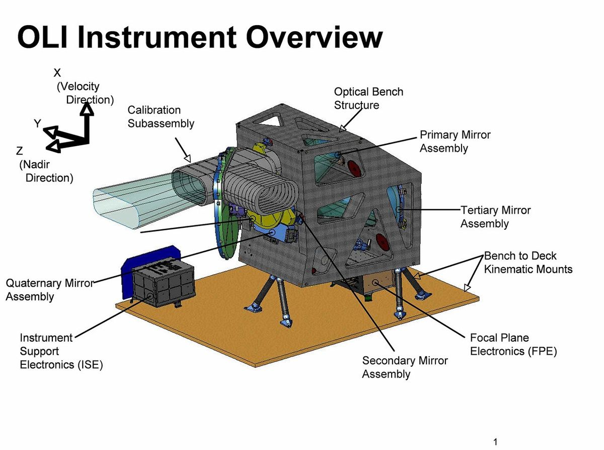
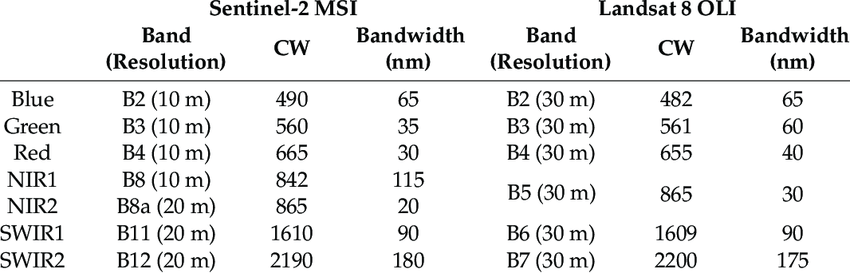
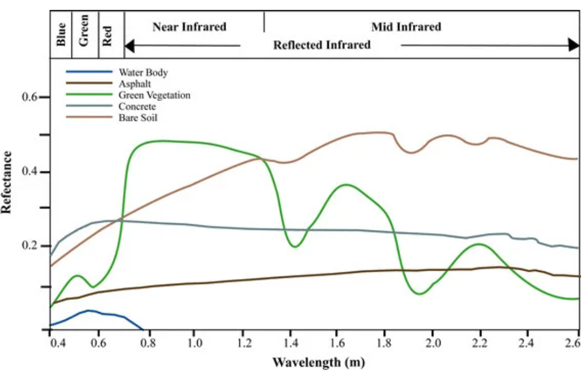
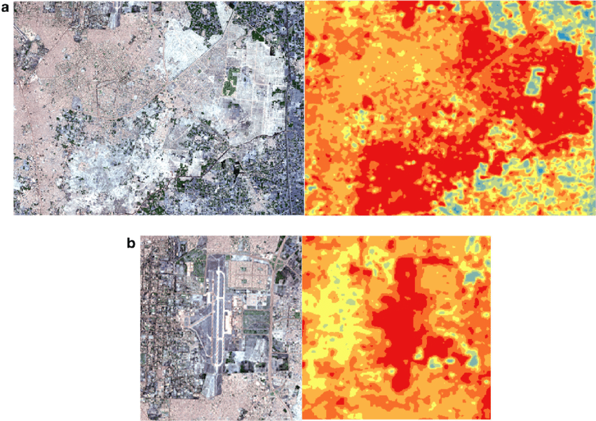
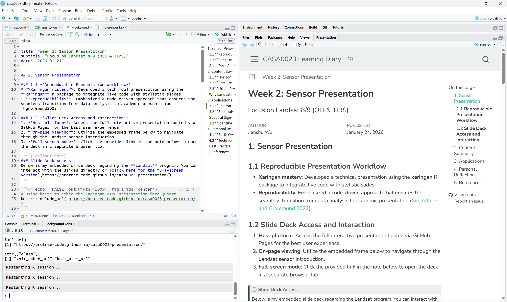

## 1. Sensor Presentation

### 1.1 **Reproducible Presentation Workflow**
* **Using xaringan**: Developed this presentation with the **xaringan** R package to combine live code with a slide-based format.
* **Reproducibility**: Focused on a code-based workflow that helps connect data analysis with presentation output [@grolemund2022].

### 1.2 **Slide Deck Access and Interaction**
1. **Host platform**: The full interactive presentation is hosted on GitHub Pages for easier access and navigation.
2. **On-page viewing**: The embedded frame below allows the slides to be viewed directly on the page.
3. **Full-screen mode**: The link in the note below opens the presentation in a separate browser tab.

::: {.callout-note}
### Slide Deck Access
Below is my embedded slide deck on the **Landsat** program. You can view the slides here or [click here for the full-screen version](https://brotree-code.github.io/casa0023-presentation/).
:::

```{r echo = FALSE, out.width='100%', fig.align='center'}
# Using knitr to embed the Xaringan HTML presentation into Quarto
knitr::include_url("https://brotree-code.github.io/casa0023-presentation/")
```

---

## 2. Content Summary

### 2.1 **Horizontal Comparison with Sentinel-2**
* **Spatial Resolution**: Sentinel-2 provides finer spatial resolution in some key optical bands, while Landsat 8/9 offers stronger long-term consistency at 30 m.
* **Spectral Advantage**: A key strength of Landsat is that it carries both optical and thermal sensors, which makes it especially useful for urban thermal studies.

### 2.2 **Satellite Payloads and Instrumentation**
* **OLI (Operational Land Imager)**: Captures data in the visible, near-infrared, and shortwave infrared parts of the spectrum.
* **TIRS (Thermal Infrared Sensor)**: Records thermal information that can be used in land surface temperature analysis.



### 2.3 **Urban Research Significance**
1. **LST Retrieval**: Estimate **Land Surface Temperature (LST)** from Landsat thermal data, most commonly using Band 10.
2. **UHI Analysis**: Identify local temperature differences to map **Urban Heat Islands (UHI)**.
3. **Climate Policy**: Use these data to support urban planning and help address heat-related risks in dense city areas.

::: {.callout-tip}
### Why Landsat for Urban Studies?
An important advantage of Landsat is its thermal bands, which make it possible to estimate **Land Surface Temperature (LST)**. This is particularly useful for studying the **Urban Heat Island (UHI)** effect.
:::



| Key Feature | **Landsat 8/9 (OLI & TIRS)** | **Sentinel-2 (MSI)** | Implications for Urban Research |
|:-----------------|:-----------------|:-----------------|:-----------------|
| **Optical Resolution** | 30 m | 10 m – 60 m | Sentinel-2 is more suitable for detailed vegetation mapping at street level. |
| **Thermal Infrared** | **Yes** | No | Landsat is more suitable for heat mapping because it includes thermal bands. |
| **Data Archive** | Since 1972 | Since 2015 | Landsat is one of the most important sources for tracking long-term urban expansion. |

---

## 3. Applications

### 3.1 **Environmental Indices and Monitoring**
* **Vegetation Analysis**: Calculate **NDVI** to measure the presence and condition of urban green spaces.
* **Cooling Effects**: Use spectral data to examine how green infrastructure may help reduce urban temperatures.

$$NDVI = \frac{NIR - Red}{NIR + Red}$$

### 3.2 **Spectral Signature Integrity**
1. **Data Acquisition**: Select suitable multispectral bands (Red and NIR) for the study area.
2. **Signature Analysis**: Distinguish land covers such as **asphalt** and **vegetation** by comparing their reflectance curves.
3. **Validation**: Compare the results with ground-truth data or high-resolution imagery to improve mapping reliability.

::: {.callout-important}
### Spectral Signature Analysis
Distinguishing between land covers requires the comparison of **spectral signatures** across multiple bands, which helps improve both interpretation and mapping quality.
:::



### 3.3 **Identifying Urban Hot Spots**
* **Urban Fabric Analysis**: Explore how different surface materials, such as concrete and grass, absorb and release heat differently.
* **Heat Spot Identification**: Identify areas where dense built-up land shows noticeably higher temperatures than surrounding areas.



---

## 4. Personal Reflection

### 4.1 **Earth Observation and Open Data**
* **Data Accessibility**: The open-access Landsat archive has made remote sensing data much easier to use for research and long-term environmental monitoring.
* **Data Fusion Potential**: Combining Landsat’s thermal information with Sentinel-2’s finer spatial detail could support more detailed urban microclimate analysis.

### 4.2 **Technical Evolution and Workflow**
1. **Xaringan Learning**: Learned how to build presentations using Markdown and CSS, which was challenging at first but useful in practice.
2. **Quarto Integration**: Began moving toward a Quarto-based workflow for managing documents and portfolio work more consistently [@kirenz_nd].
3. **Reproducibility Mastery**: Gained a better understanding of how code and written explanation can be combined in scientific communication [@xie2022].
4. **Future Research**: I hope to apply these reproducible methods in future academic work so that my analysis remains clear and verifiable [@quarto_quickstart].

::: {.callout-caution}
### Best Practice: Project Separation
As discussed in the module, it is generally better not to carry out complex analysis and portfolio writing in the same R project, because keeping them separate helps maintain clarity and organisation.
:::



---

## 5. References

::: {#refs}
:::