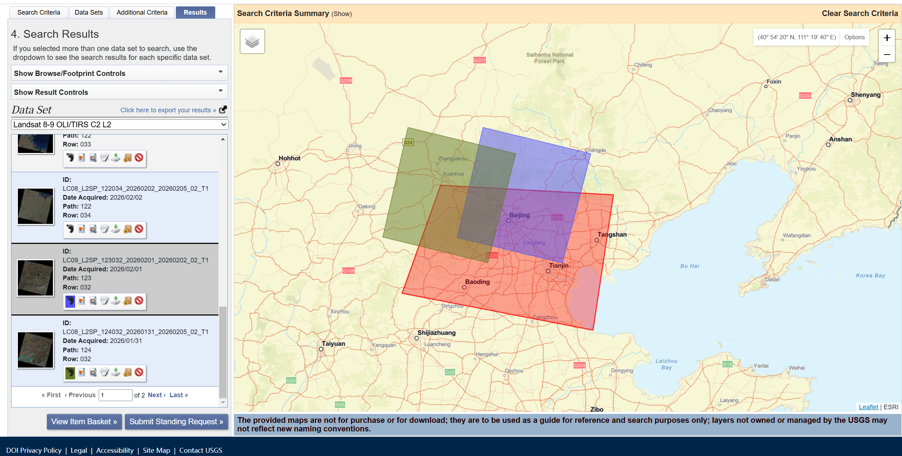
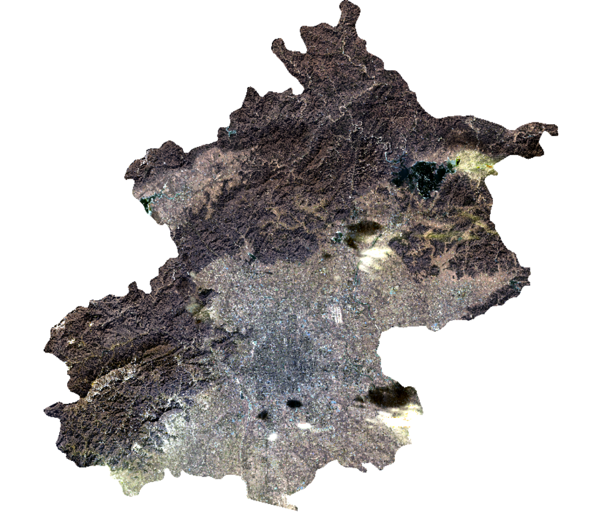
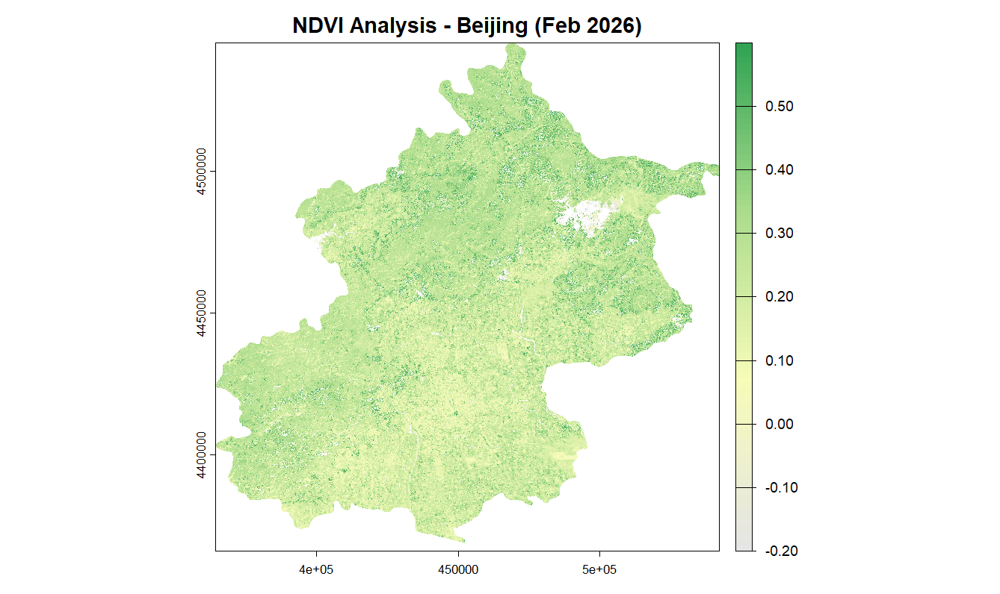
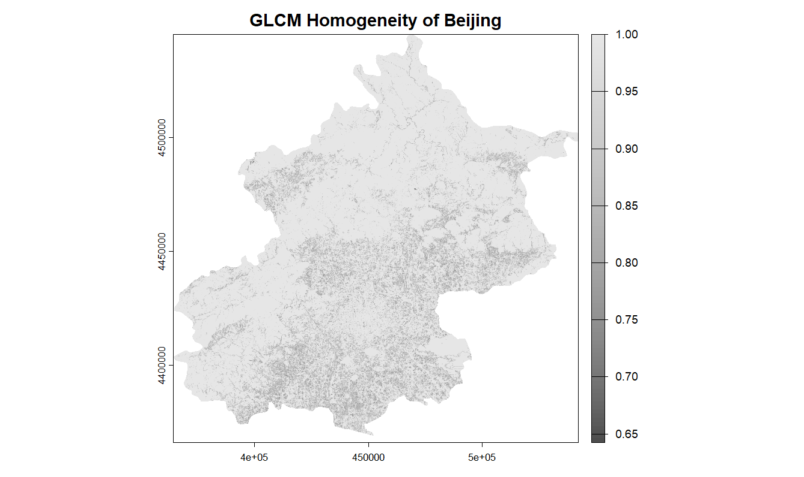
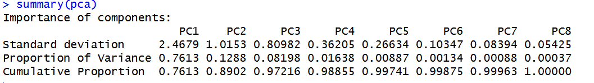
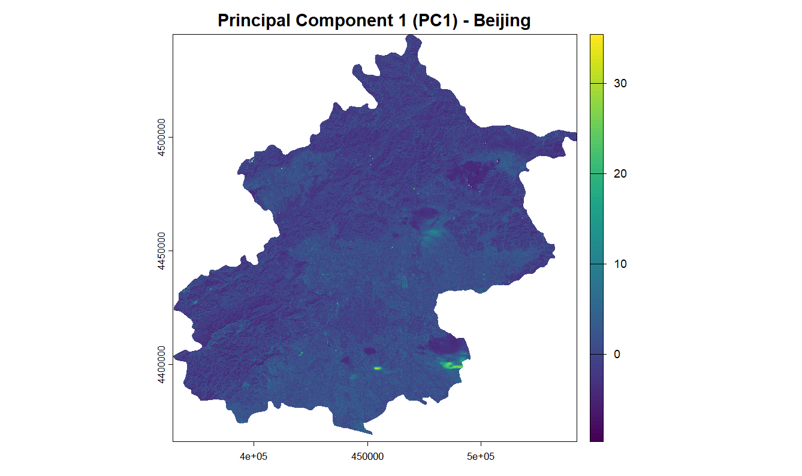

## 1. Content Summary

### 1.1 Physical Fundamentals and Correction Necessity
This week changed the way I think about satellite imagery. I used to see it as something similar to a digital photo, but now I understand that it is actually a measurement of **electromagnetic radiation**. Because of that, the original **Digital Numbers (DN)** cannot be used directly without some form of correction.

The first step is **radiometric calibration**, which converts raw DN values into physically meaningful **spectral radiance**.

::: {.callout-note}
## Core Concept: Radiance vs. Reflectance
Radiance is the total energy coming from the ground to the sensor, while reflectance describes how much incoming light is reflected by the surface. Reflectance is more useful for environmental comparison because it is more consistent across time and space [@joyce2013].
:::

### 1.2 Geometric and Atmospheric Corrections
* **Geometric distortions** — caused by sensor angle or terrain effects, usually corrected with Ground Control Points (GCPs)
* **Atmospheric correction** — the atmosphere scatters and absorbs light, shifting apparent reflectance values; **Dark Object Subtraction (DOS)** addresses this by treating the darkest pixels as a near-zero reflectance reference [@jensen2015]

### 1.3 Topographic Correction and Enhancements
In mountainous areas, **slope and aspect** can change the amount of sunlight reaching the surface, which affects reflectance values. The **Cosine Correction Model** is one way to reduce this terrain effect by using the **incidence angle**:
$$\cos i = \cos \theta_0 \cos \theta_s + \sin \theta_0 \sin \theta_s \cos(\Phi_0 - \Phi_s)$$

---

## 2. Applications of the Content

### 2.1 Data Acquisition and Methodology
Although this week’s lectures covered radiometric, atmospheric, and topographic corrections in detail, the practical work in this report is mainly about mosaicking, feature extraction, and dimensionality reduction. 

For this case study, I used **Landsat Collection 2 Level-2** products for the Greater Beijing area, acquired on Jan 31 and Feb 1, 2026. 

::: {.callout-important}
## Why bypass DOS Atmospheric Correction?
Since these Landsat scenes are provided as Analysis Ready Data (ARD), they have already been rigorously atmospherically corrected by the USGS. Applying an extra DOS correction here would redundantly alter the data and introduce errors. Instead, I focused on rescaling the stored integer values into surface reflectance values.
:::



### 2.2 Mosaicking and Rescaling Workflow
Because Landsat data is collected in separate tiles, I first needed to merge the two neighbouring scenes. I used the `terra::mosaic()` function, and the overlap was averaged with the `mean` option. This helped reduce obvious **seam lines** between the two scenes, although some small differences may still remain because they were taken on different dates.

```{r}
#| eval: false
#| echo: true

# Mosaicking and Masking to Beijing Boundary
beijing_mosaic <- terra::mosaic(LC08, LC09, fun="mean")

beijing_clipped <- beijing_mosaic %>%
  terra::crop(., beijing_boundary) %>%
  terra::mask(., beijing_boundary)

# Rescale Level-2 bands to Surface Reflectance (SR)
beijing_sr <- (beijing_clipped * 0.0000275) - 0.2

# Simple value-range cleaning
# A simple cleaning step was used to suppress problematic pixels, 
# although no full pixel-level QA cloud mask was implemented in this workflow.
beijing_sr[beijing_sr < -0.2 | beijing_sr > 1.2] <- NA

# 4. Plot the mosaicked study area as a true colour image
terra::plotRGB(
  beijing_clipped,
  r = 4, g = 3, b = 2,
  stretch = "lin",
  main = "Mosaicked Landsat 8/9 Product - Beijing"
)
```



### 2.3 Spectral and Structural Feature Extraction

#### NDVI: Spectral Interpretation

::: {.callout-tip}
## Dealing with Non-physical Anomalies
Because the rescaling equation includes a negative offset (`-0.2`), certain dark pixels (like water or shadows) can produce denominators close to zero in the NDVI formula. Filtering the data to the theoretical NDVI range of `[-1, 1]` is essential to remove mathematical artifacts and restore the true visual contrast.
:::

```{r}
#| eval: false
#| echo: true

# Calculate NDVI
ndvi <- (beijing_sr[[5]] - beijing_sr[[4]]) / (beijing_sr[[5]] + beijing_sr[[4]])

# Clean physically implausible extreme values:
# remove all anomalous pixels falling outside the theoretical NDVI range of [-1, 1]
ndvi[ndvi < -1 | ndvi > 1] <- NA

# Define a new colour palette
veg_palette <- colorRampPalette(c("#e5e5e5", "#f7fcb9", "#addd8e", "#31a354"))(100)

# Plot the NDVI map again, and fix the display range to improve visual contrast
plot(ndvi, 
     col = veg_palette, 
     zlim = c(-0.2, 0.6),  # fix the display range to enhance visual contrast
     main = "NDVI Analysis - Beijing (Feb 2026)", 
     axes = TRUE)
```

**Interpretation of Figure 3:** The NDVI map shows generally low vegetation activity across Beijing in early February, consistent with **winter dormancy**. Slightly higher values are visible in some mountain and vegetated areas. Some white gaps remain after cleaning, indicating pixels with invalid or unstable NDVI values that may be linked to **residual cloud contamination**, very bright surfaces, water, or other problematic pixels. This highlights the importance of **quality control** before interpretation.

#### GLCM Texture: Structural Interpretation

```{r}
#| eval: false
#| echo: true

# Compute GLCM Homogeneity using Band 4
library(GLCMTextures)
textures1 <- glcm_textures(
  beijing_sr[[4]],
  w = c(7, 7),
  n_levels = 4,
  quant_method = "range",
  metrics = "glcm_homogeneity"
)

# Plot GLCM Homogeneity
plot(
  textures1,
  main = "GLCM Homogeneity of Beijing",
  col = gray.colors(100)
)
```

**Interpretation of Figure 4:** The **GLCM homogeneity** surface ranges from about 0.65 to 1.00 and appears fairly smooth overall. Lower homogeneity is more visible in parts of the **urban plain**, where dense built-up structures create greater local variation. By contrast, many northern and peripheral areas appear more homogeneous, although this pattern should be interpreted carefully because the **7×7 window** may smooth fine-scale differences and mountain terrain can also introduce local texture complexity.

::: {layout-ncol=2}



:::

### 2.4 Dimensionality Reduction via PCA

Fusing spectral data with spatial metrics increases dimensionality, and **PCA** is a practical way to compress the combined multi-band stack into **uncorrelated components** without discarding too much information [@schultetobuhne2018].

```{r}
#| eval: false
#| echo: true

# Data Fusion: Concatenate the multi-spectral bands and texture features
raster_and_texture <- c(beijing_sr, textures1)

# PCA applied to the combined feature stack (standardized)
pca <- prcomp(
  as.data.frame(raster_and_texture, na.rm = TRUE),
  center = TRUE,
  scale = TRUE
)

# Show PCA summary
summary(pca)

# Project PCA results back to raster space
pca_raster <- predict(raster_and_texture, pca)

# Plot PC1
plot(
  pca_raster[[1]],
  main = "Principal Component 1 (PC1) - Beijing"
)
```

**Interpretation of Figure 5 & 6:** The summary table shows that **PC1 explains approximately 76%** of the standardized variance. The spatial projection of PC1 suggests that, in addition to broad landscape differences, some of the highest values are likely associated with **residual clouds or haze** that remain visible in the true-colour composite. Because PCA captures the strongest sources of variance, it is sensitive to **extreme reflectance values**. This suggests that **incomplete cloud masking** may have influenced the first component and therefore affected downstream interpretation.





---

## 3. Personal Reflection

### 3.1 Understanding the "Black Box"
Even though modern platforms provide **Analysis Ready Data (ARD)**, I think it is still worth understanding what is happening underneath. If I work with raw drone imagery or less processed sensors later, knowing methods like **DOS** and **radiometric calibration** will be necessary to trust the results.

### 3.2 Methodological Limitations and Future Improvements
This week’s exercise made me realise how important pre-processing is for later analysis. There are two things I would do differently next time. The first is using the `QA_PIXEL` band for cloud masking rather than relying on visual inspection and simple value-range filtering — the current approach leaves some residual cloud or shadow contamination in the data. The second is topographic correction, which would be particularly relevant for northern Beijing's mountain areas. I skipped it here due to time constraints, but it would improve reliability in those areas considerably.

---

## 4. References

::: {#refs}
:::