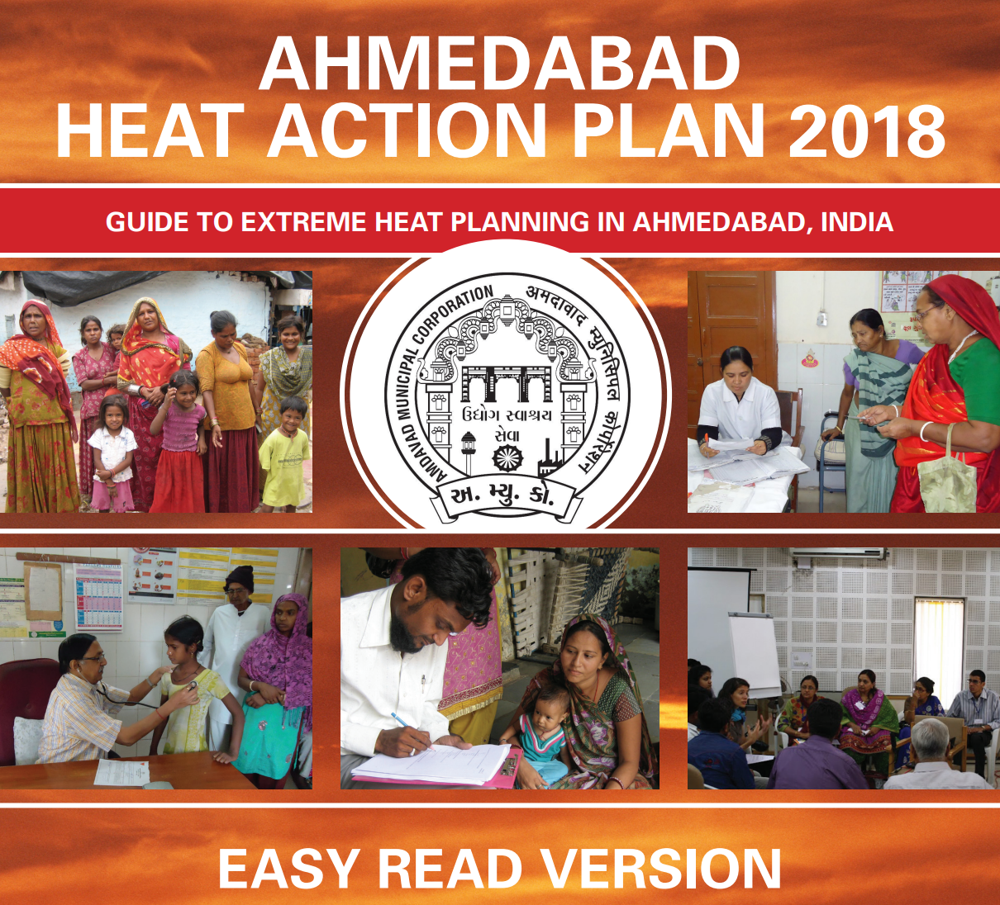
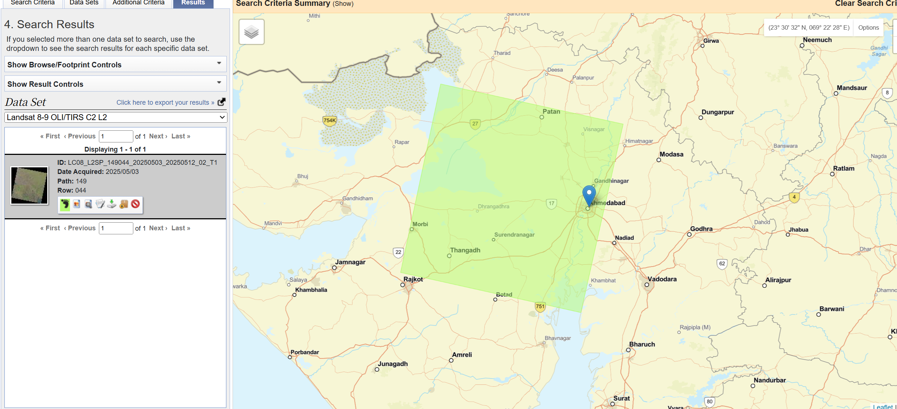
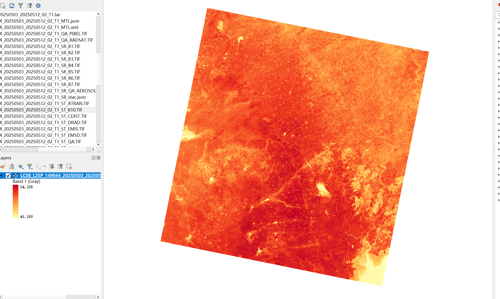
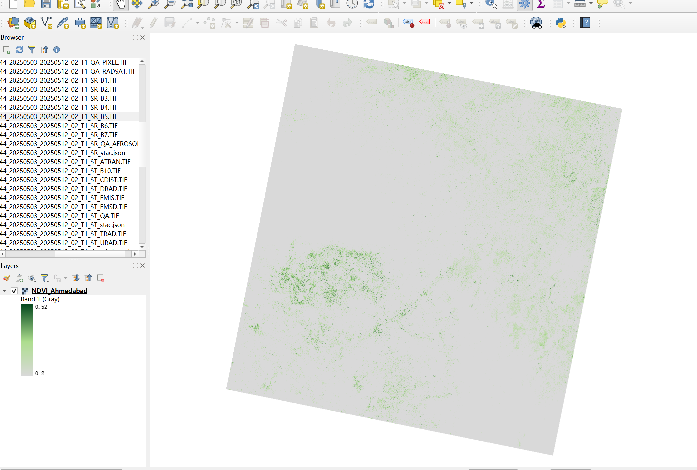
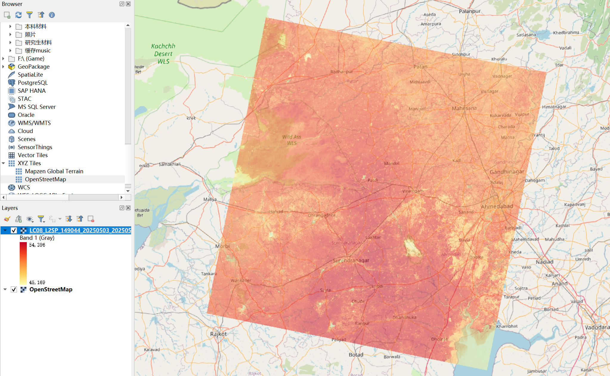

## 1. Content Summary 

### 1.1 Earth Observation in Policy Frameworks

Over the past two weeks, the module shifted from the physical side of satellite sensors to how **EO** actually feeds into **urban governance**. What I took away is that the task here is not just to describe datasets, but to think about which kind of remotely sensed evidence could genuinely help with a real **policy problem** — and at what scale. That framing made me look at the relationship between data and policy decisions more carefully than I had before [@gerasopoulos2022].

::: {.callout-important title="Learning the Shift"}
Traditional urban planning often relied on sparse, ground-based surveys. What EO offers instead is **spatially continuous, repeatable observation** — which is a fundamentally different kind of evidence for decision-making.
:::

* **Ecologically sound policies** — [@wellmann2020] argues remote sensing only becomes genuinely useful when it moves beyond land-cover mapping to assessing urban ecosystems, which is a higher bar than most current applications reach
* **Monitoring interventions** — continuous observation is what lets us check whether any given policy action is actually working, not just assumed to be [@kadhim2016]
* **Phenological timing** — vegetation health assessments need multi-temporal data because seasonal patterns affect what indices like NDVI actually represent [@jensen2015]

### 1.2 Addressing Metropolitan Policy Challenges

I focused my case study on the **Ahmedabad 2018 Heat Action Plan (HAP)** (Figure 1). The key thing I noticed is that heatwaves do not hit the city evenly — the **Urban Heat Island (UHI)** effect means dense areas run significantly hotter. So the policy problem is not just about extreme heat in general, but about locating where **heat exposure** is concentrated and who is most exposed. [@li2022] makes a related point: **historical zoning** has often left low-income neighbourhoods in precisely the hottest spots. Figure 1 captures this by centering on vulnerable populations in informal settlements. Working through this case made me see how EO is most useful not just for mapping environmental conditions, but for showing where **risk is unevenly distributed**.

::: {.callout-note title="Linking to Global Agendas"}
I now see how the local implementation of the Ahmedabad HAP directly contributes to **SDG Target 11.5** (reducing disaster deaths) and **Target 13.1** (strengthening resilience).
:::

---

## 2. Applications of the Content 

### 2.1 Identifying and Evaluating EO Datasets

To assist the Ahmedabad HAP, I identified **Landsat 8-9 (Path 149, Row 044)** as the dataset to work with (Figure 2). One thing that caught me off guard early on was the raw values in the **Thermal Band (ST_B10)** — they came out in the range 45,169–54,396, which are clearly not temperatures. They need to be converted using the **Landsat scale factor** and offset to get surface temperature in Kelvin:

$$
T(K) = DN \times 0.00341802 + 149.0
$$

More broadly, choosing a dataset always involves a trade-off between **temporal frequency** and **spatial detail**. For this particular case, Landsat works well because it provides both thermal information and a spatial resolution that is still interpretable at the urban scale.

### 2.2 Demystifying NDVI for Policy Interventions

A key strategy in the HAP is mitigating heat through greening. However, raw **NDVI** maps are insufficient for policymakers. Following [@martinez2023], NDVI needs to be **"demystified"** into **actionable categories**.

::: {.callout-tip title="Translating Science to Policy"}
As shown in **Figure 4**, I reclassified the derived NDVI (ranging from -0.32 to 0.52). I used values **> 0.2** as a **simple proxy for greener cover**, while grey areas denote **"Non-vegetated"** surfaces. This allows planners to identify "greening deserts" more easily.
:::

### 2.3 Workflow and Policy Matrix

During the workshop, I developed a conceptual workflow to translate raw radiance into solutions. This simple matrix helped me connect each policy objective with a specific EO indicator and showed that remote sensing becomes more meaningful when it is tied to a concrete decision-making purpose.

| Policy Objective | Required EO Metric | Satellite Source | Policy Application |
| :--- | :--- | :--- | :--- |
| Identify Heat Vulnerability | Land Surface Temperature (LST) | Landsat 8/9 (TIRS) | Directing emergency services to maximum LST zones (Figure 5). |
| Urban Greening Assessment | Classified NDVI | Landsat 8 / Sentinel-2 | Identifying neighborhoods lacking canopy for priority planting (Figure 4). |

---

## 3. Personal Reflection 

### 3.1 The Gap Between Academic Remote Sensing and Policy

The tension I kept running into is between getting the data right and actually being useful to a planner. I used to focus mainly on minimising errors, but working through this case made it clear that policymakers often need something that is **good enough and delivered on time**. During a heatwave response, more **frequent observations** might matter more than a finer **spatial resolution**.

### 3.2 Rethinking Data Justice

The overlay analysis in **Figure 5** shifted how I read thermal maps. A hotspot is not just a physics result — it often reflects where **historical planning decisions** concentrated vulnerable populations. Working with this data properly means pairing raster outputs with **ward-level demographic data**, not treating the map as self-explanatory.

There are also some straightforward limitations I noticed. The Landsat scene covers a much wider area than the city, so further **clipping** would be needed for targeted use. A single image only captures one moment, so comparing **multiple dates** would give a more reliable picture of heat conditions. If I extended this work, combining the **thermal and greenness layers** with socio-economic data would make the outputs more directly actionable for public health planning.

---

## 4. References

::: {#refs}
:::