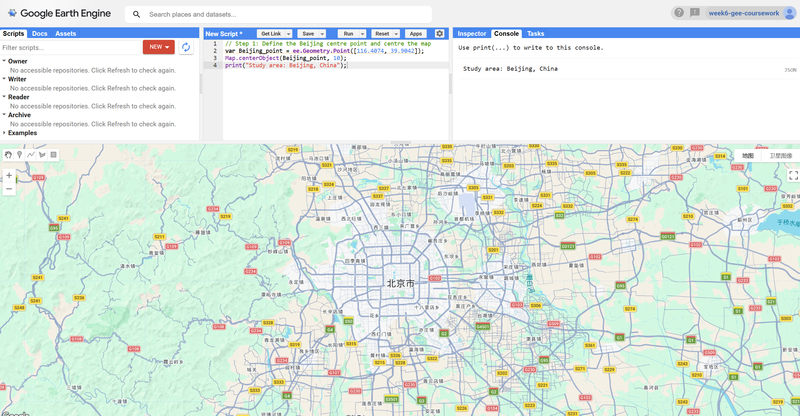
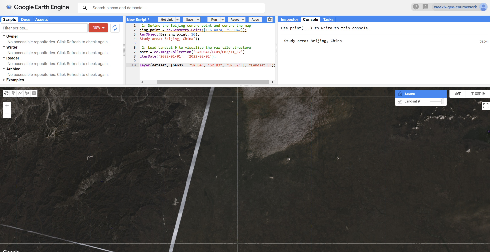
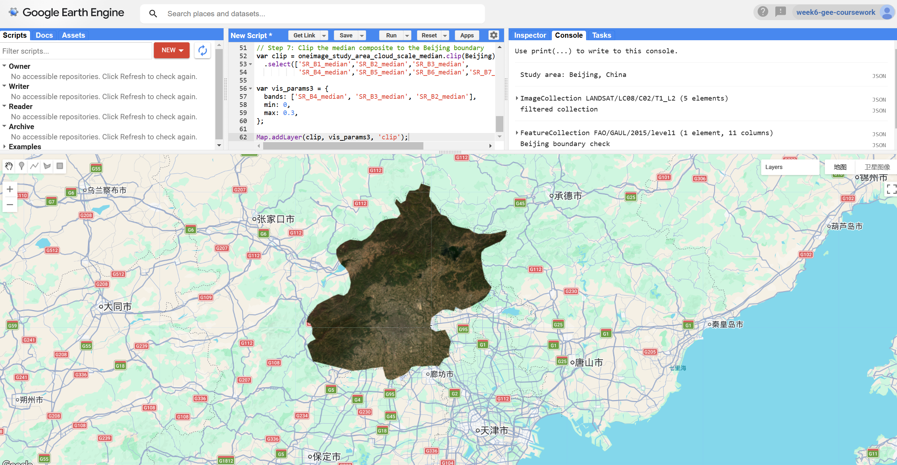
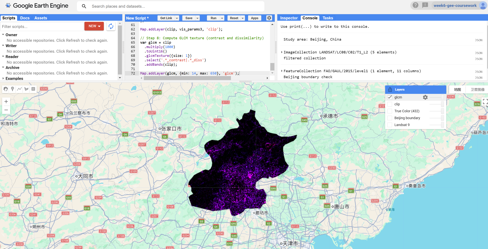
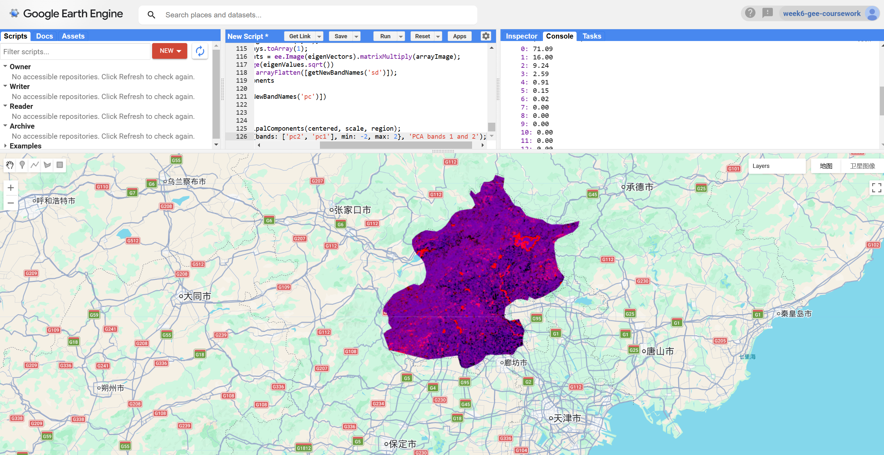
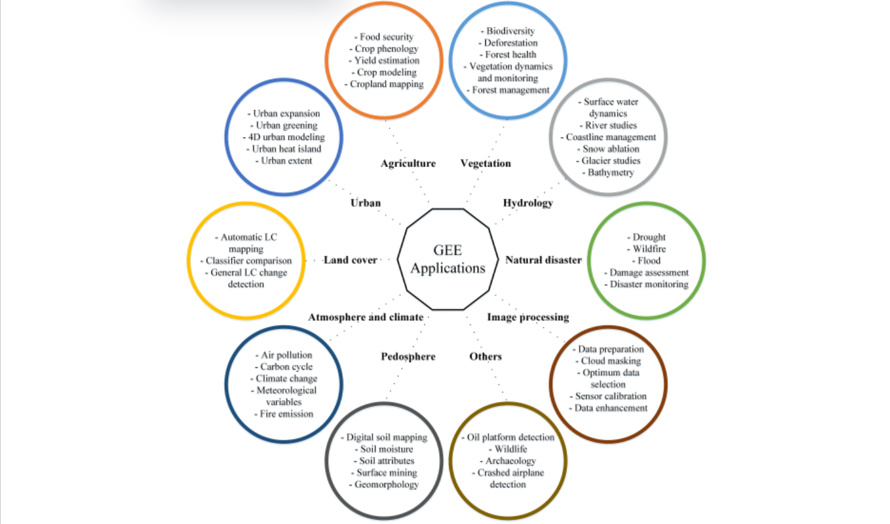

## 1. Content Summary

### 1.1 What Is Google Earth Engine and Why Does It Matter?

This week we moved away from R entirely and into **Google Earth Engine** — which honestly felt like switching from riding a bicycle to getting on a train. The core idea behind **GEE** is that instead of downloading satellite data and processing it locally, everything lives on Google's servers and your code is sent there to run [@gorelick2017]. I knew this conceptually before the session, but it only really clicked when I realised that even loading a Landsat collection doesn't actually bring any pixels to my browser — it just creates a **proxy object** that points to data somewhere else.

The scripting language is **JavaScript**, which I'd never used before. But it turns out you really don't need much of it:

* **Variables** — declared with `var`, used for everything from numbers to image collections
* **Lists** — square bracket arrays for storing multiple values
* **Dictionaries** — key-value objects using curly braces
* **Functions** — reusable blocks of logic, essential for `.map()` workflows
* **`print()`** — the main way to inspect objects in the Console

The bigger adjustment is getting used to GEE's own way of thinking about data, where everything is a **server-side object** and nothing actually computes until you explicitly ask for a result [@gee_book2020].

::: {.callout-note}
## Client vs. Server: the Core Mental Model
In GEE, `var dataset = ee.ImageCollection(...)` does **not** download anything. It creates a "proxy" object on the server. Computation only happens when a terminal action is called — for example `Map.addLayer`, `print`, or `Export`. This **lazy evaluation** model is why GEE can scale to planetary analysis without overloading your browser.
:::



### 1.2 GEE Data Model: Images, Collections, and Features

One thing that helped me a lot this week was mapping GEE's terminology onto things I already knew from R and QGIS. GEE has a small set of core **object classes**, each with its own methods [@amani2020]:

| Object Class | Equivalent | Description |
|---|---|---|
| `ee.Image` | Raster | A single multi-band raster |
| `ee.ImageCollection` | Raster stack | A set of images (e.g., all Landsat 8 scenes) |
| `ee.Geometry` | Vector | A point, line, or polygon with no attributes |
| `ee.Feature` | Vector + attributes | A geometry with a property dictionary |
| `ee.FeatureCollection` | Shapefile | Multiple features combined |
| `ee.Reducer` | Aggregation | A function that summarises data (mean, median, etc.) |

: GEE Core Object Classes and Their Analogies {#tbl-objects}

Getting this table straight in my head made the code much easier to follow. For instance, reducing a temporal image stack uses `ImageCollection.reduce(ee.Reducer.median())`, but if you want statistics over a region, you call `Image.reduceRegion()` — they look similar but operate on completely different axes.

Something that tripped me up a bit was the concept of **scale in GEE**. Two things worth remembering:

* **Scale refers to output resolution** — not the native resolution of the input dataset
* **Default scale is zoom-dependent** — if you don't set it explicitly, GEE guesses based on your current map zoom level, which means the same script can return different numbers just because you scrolled in or out

That second point is a real **reproducibility** problem [@gee_book2020].

::: {.callout-important}
## Why Set Scale Explicitly?
If you do not specify `scale: 30` in a `reduceRegion()`, GEE will infer the scale from the current map zoom level. This means the same script can return different numerical results depending on how far you are zoomed in — a serious reproducibility issue for any research workflow.
:::

### 1.3 Key Analytical Operations Covered

A lot of what we covered this week was actually familiar from the R practicals — but now running on the **server side**, which changes how you write the code even if the logic is the same:

1. **Filtering** — image collections by date, geographic bounds, and metadata properties such as `CLOUD_COVER`
2. **Scaling** — converting stored integer **DN values** to surface reflectance using the Landsat Collection 2 factors
3. **Reducing** — collapsing a collection to a single composite image via `.reduce(ee.Reducer.median())`
4. **Mosaicking** — merging overlapping tiles and comparing last-on-top vs. mean strategies
5. **Texture analysis** — computing **GLCM** measures using `glcmTexture()` on integer-converted bands
6. **PCA** — dimensionality reduction via GEE's Eigen Analysis approach
7. **Exporting** — saving outputs to Google Drive, Cloud Storage, or as a GEE Asset

---

## 2. Applications of the Content

### 2.1 Workshop: Defining the Study Area

I applied this week's workflow to **Beijing** instead of the Delhi example from the lecture. The starting point was simple — just defining a **centre point** and making sure the map jumped to the right place:

<details>
<summary>Show GEE code</summary>

```javascript
// Step 1: Define the Beijing centre point and centre the map
var Beijing_point = ee.Geometry.Point([116.4074, 39.9042]);
Map.centerObject(Beijing_point, 10);
print("Study area: Beijing, China");
```

</details>

### 2.2 Workshop: First Look at Raw Landsat Tiles

Before doing any filtering, I loaded a raw **Landsat 9** collection just to see what the data actually looks like straight out of the archive:

<details>
<summary>Show GEE code</summary>

```javascript
// Step 2: Load Landsat 9 to visualise the raw tile structure
var dataset = ee.ImageCollection('LANDSAT/LC09/C02/T1_L2')
    .filterDate('2022-01-01', '2022-02-01');

Map.addLayer(dataset, {bands: ["SR_B4", "SR_B3", "SR_B2"]}, "Landsat 9");
```

</details>

What I noticed immediately was that the tiles don't line up neatly. Two issues were obvious:

* **Seam lines** — a diagonal boundary is clearly visible in the northern mountain area where two scenes meet
* **Brightness differences** — adjacent tiles have different tones because they were captured on different dates under different atmospheric conditions

This made it obvious why we can't just use raw imagery for any kind of regional analysis.



### 2.3 Workshop: Filtering the Landsat 8 Collection

Landsat 9 didn't have enough clear scenes over Beijing in that date range, so I switched to **Landsat 8** with a longer time window. Following the workshop, I used a **cloud cover threshold** of `0.1` to keep only the clearest scenes. The result was **5 cloud-free scenes**, which was enough to work with:

<details>
<summary>Show GEE code</summary>

```javascript
// Step 3: Filter Landsat 8 to cloud-free scenes over Beijing
// Cloud cover threshold of 0.1 follows the workshop methodology
var oneimage_study_area_cloud = ee.ImageCollection('LANDSAT/LC08/C02/T1_L2')
  .filterDate('2020-01-01', '2022-10-10')
  .filterBounds(Beijing_point)
  .filter(ee.Filter.lt("CLOUD_COVER", 0.1));

print(oneimage_study_area_cloud, "filtered collection");
```

</details>

### 2.4 Workshop: Loading the Beijing Administrative Boundary

Rather than uploading a shapefile, I used the **FAO GAUL** administrative boundary dataset that's already loaded in GEE. This saved a lot of time — but I immediately hit a problem. When I tried filtering for `'Beijing'`, GEE returned zero features. After some digging with `aggregate_array()`, I found out the dataset stores it as `'Beijing Shi'`. Small thing, but it took a while to figure out:

<details>
<summary>Show GEE code</summary>

```javascript
// Step 4: Load Beijing administrative boundary from FAO GAUL
// Note: the correct ADM1_NAME is 'Beijing Shi', not 'Beijing'
var Beijing = ee.FeatureCollection('FAO/GAUL/2015/level1')
    .filter(ee.Filter.eq('ADM0_NAME', 'China'))
    .filter(ee.Filter.eq('ADM1_NAME', 'Beijing Shi'));

Map.addLayer(Beijing, {color: 'red'}, 'Beijing boundary');
Map.centerObject(Beijing, 9);
print(Beijing, 'Beijing boundary check');
```

</details>

### 2.5 Workshop: Applying Landsat Collection 2 Scale Factors

The **Landsat Collection 2** data stores reflectance as integers, so before doing anything analytical you have to convert them to actual **surface reflectance** values. The formula is:

$$\rho = DN \times 0.0000275 + (-0.2)$$

In GEE, this gets applied as a function **mapped** across every image in the collection. I found the `.map()` approach intuitive once I understood why for-loops don't work here — the loop runs on my browser, but the data is on the server, so there's no way for it to know how many images to iterate over until they're all downloaded:

<details>
<summary>Show GEE code</summary>

```javascript
// Step 5: Apply Landsat C2 surface reflectance scaling factors
function applyScaleFactors(image) {
  var opticalBands = image.select('SR_B.').multiply(0.0000275).add(-0.2);
  var thermalBands = image.select('ST_B.*').multiply(0.00341802).add(149.0);
  return image.addBands(opticalBands, null, true)
              .addBands(thermalBands, null, true);
}

var oneimage_study_area_cloud_scale = oneimage_study_area_cloud.map(applyScaleFactors);
```

</details>

::: {.callout-note}
## Why `.map()` Instead of a For-Loop?
In GEE, a standard JavaScript for-loop runs on the client side and does not know how many images exist in the server-side collection until they are downloaded. The `.map()` function sends the entire operation to the server and applies it in parallel across all images — which is both faster and architecturally correct [@gee_book2020].
:::

### 2.6 Workshop: Building the Median Composite and Clipping to Beijing

With the scaled collection ready, I reduced it to a single image using the **median reducer** and then clipped it to the Beijing boundary. The **median** makes sense here because with only 5 scenes, any cloud or haze that slipped through the filter would distort a mean — the median is much less sensitive to those outliers:

<details>
<summary>Show GEE code</summary>

```javascript
// Step 6: Reduce to median composite and display as true colour
var oneimage_study_area_cloud_scale_median =
    oneimage_study_area_cloud_scale.reduce(ee.Reducer.median());

var vis_params = {
  bands: ['SR_B4_median', 'SR_B3_median', 'SR_B2_median'],
  min: 0.0,
  max: 0.3,
};

Map.addLayer(oneimage_study_area_cloud_scale_median, vis_params, 'True Color (432)');

// Step 7: Clip the median composite to the Beijing boundary
var clip = oneimage_study_area_cloud_scale_median.clip(Beijing)
  .select(['SR_B1_median','SR_B2_median','SR_B3_median',
           'SR_B4_median','SR_B5_median','SR_B6_median','SR_B7_median']);

var vis_params3 = {
  bands: ['SR_B4_median', 'SR_B3_median', 'SR_B2_median'],
  min: 0,
  max: 0.3,
};

Map.addLayer(clip, vis_params3, 'clip');
```

</details>

::: {.callout-tip}
## Why Use the Median Rather Than the Mean?
The median is more robust to outliers such as residual cloud pixels or sensor noise. With a sufficiently large collection, the median effectively removes anomalous high reflectance values caused by clouds and low values caused by shadows. The mean is pulled towards these extremes and would produce a hazier result. It is worth noting, however, that **median compositing** can suppress short-term surface change signals, which may be a limitation for studies focused on rapid land cover transitions.
:::

The result came out quite dark, which makes sense given the scenes were mostly acquired in **winter** when vegetation is dormant and the sun angle is low. But the Beijing boundary shape is clearly defined and you can still make out the difference between the **urban core** and the surrounding rural areas.



### 2.7 Workshop: GLCM Texture Analysis

After getting the clipped composite, I moved on to **GLCM texture analysis**, which captures how much spatial variation there is within a small neighbourhood around each pixel. The idea is that a city block has very different textures compared to a flat agricultural field, even if their average **reflectance values** might be similar [@amani2020].

There was a gotcha here too. Two issues came up in sequence:

* **Integer requirement** — `glcmTexture()` only works with integer data, so I had to multiply reflectance values by 1000 and cast to `Uint16` first
* **Band name mismatch** — the original regex `SR_.._contrast` from the workshop failed because after reducing to a median, all band names had a `_median` suffix; changing to `.*_contrast` fixed it

<details>
<summary>Show GEE code</summary>

```javascript
// Step 8: Compute GLCM texture (contrast and dissimilarity)
// glcmTexture() requires integer data, so multiply by 1000 and cast first
// Use '.*_contrast|.*_diss' to match band names with the '_median' suffix
var glcm = clip
  .multiply(1000)
  .toUint16()
  .glcmTexture({size: 1})
  .select('.*_contrast|.*_diss')
  .addBands(clip);

Map.addLayer(glcm, {min: 14, max: 650}, 'glcm');
```

</details>

The output shows the **urban core** in brighter magenta tones, which makes sense — more building edges and surface variation means higher **texture values**. The northern mountains also show up quite textured though, which is a reminder that high GLCM values don't automatically mean urban — **terrain** can produce similar patterns.



### 2.8 Workshop: PCA over the Combined Spectral-Texture Stack

The final step was running **PCA** on the combined stack of spectral bands and GLCM texture outputs. In R this would have been a single `prcomp()` call. In GEE it's considerably more involved — you have to manually compute the **covariance matrix**, extract **eigenvalues** and **eigenvectors**, then project the data yourself. The code is adapted from the GEE Eigen Analysis guide and took me a while to work through:

<details>
<summary>Show GEE code</summary>

```javascript
// Step 9: PCA — set up scale, band names, and study region
var scale = 30;
var bandNames = glcm.bandNames();
var region = Beijing.geometry();

Map.centerObject(region, 10);
Map.addLayer(ee.Image().paint(region, 0, 2), {}, 'Region');

// Mean-centre the data across the Beijing region
var meanDict = glcm.reduceRegion({
    reducer: ee.Reducer.mean(),
    geometry: region,
    scale: scale,
    maxPixels: 1e9
});
var means = ee.Image.constant(meanDict.values(bandNames));
var centered = glcm.subtract(means);

// Helper: generate sequential band names (e.g. pc1, pc2 ...)
var getNewBandNames = function(prefix) {
  var seq = ee.List.sequence(1, bandNames.length());
  return seq.map(function(b) {
    return ee.String(prefix).cat(ee.Number(b).int());
  });
};

// PCA function: covariance → eigendecomposition → project → normalise by SD
var getPrincipalComponents = function(centered, scale, region) {
  var arrays = centered.toArray();
  var covar = arrays.reduceRegion({
    reducer: ee.Reducer.centeredCovariance(),
    geometry: region,
    scale: scale,
    maxPixels: 1e9
  });
  var covarArray = ee.Array(covar.get('array'));
  var eigens = covarArray.eigen();
  var eigenValues = eigens.slice(1, 0, 1);

  // Print percentage variance explained by each component
  var eigenValuesList = eigenValues.toList().flatten();
  var total = eigenValuesList.reduce(ee.Reducer.sum());
  var percentageVariance = eigenValuesList.map(function(item) {
    return (ee.Number(item).divide(total)).multiply(100).format('%.2f');
  });
  print("percentageVariance", percentageVariance);

  var eigenVectors = eigens.slice(1, 1);
  var arrayImage = arrays.toArray(1);
  var principalComponents = ee.Image(eigenVectors).matrixMultiply(arrayImage);
  var sdImage = ee.Image(eigenValues.sqrt())
    .arrayProject([0]).arrayFlatten([getNewBandNames('sd')]);
  return principalComponents
    .arrayProject([0])
    .arrayFlatten([getNewBandNames('pc')])
    .divide(sdImage);
};

// Run PCA and display the first two components
var pcImage = getPrincipalComponents(centered, scale, region);
Map.addLayer(pcImage, {bands: ['pc2', 'pc1'], min: -2, max: 2}, 'PCA bands 1 and 2');
```

</details>

The Console output showed **PC1 captured 71.09% of the total variance** and **PC2 a further 16.00%** — so just two components hold over **87%** of the information from the entire multi-band stack. That's a pretty striking result, and it shows how much **redundancy** there is between the spectral and texture bands. That said, PC1 doesn't map directly onto anything interpretable like "vegetation" or "built-up area" — you'd need labelled **training data** to make sense of what each component actually represents [@amani2020].



### 2.9 GEE in Urban Remote Sensing: Literature Applications

Reading around this week helped me see where GEE sits in the broader research landscape. @gorelick2017 describes GEE as built specifically for the kind of **planetary-scale** work that simply wasn't possible before cloud computing — and urban remote sensing has been one of the big beneficiaries.

@amani2020 surveyed hundreds of GEE papers and found that **urban studies** are among the most common use cases:

* **Impervious surface mapping** — tracking built-up area expansion in rapidly growing Asian megacities
* **Urban heat island monitoring** — using Landsat thermal bands to map temperature patterns across cities
* **Informal settlement detection** — identifying unplanned urban growth at scales previously impossible without cloud computing

What strikes me is that most of these analyses use the same **Landsat archive** I worked with this week — but applied over decades rather than a two-year window. The GEE Applications topical collection [@gee_applications] documents a wide range of these urban remote sensing studies, and browsing the urban-related entries gives a good sense of what kinds of research questions the platform has made tractable. As Figure 6 shows, the range of urban applications goes well beyond just **land cover mapping** — it spans greening, heat islands, and **4D urban modelling**, all of which depend on the kind of large-scale, multi-temporal processing that GEE enables.

The *Cloud-Based Remote Sensing with Google Earth Engine* textbook [@gee_book2020] goes into this in more detail in Chapters A1.2 and A1.3, and @kochenour2020 has some nice worked examples of combining different data sources — like pairing **Sentinel-5P** air quality data with urban footprint layers — which would be a nightmare to do locally but is fairly straightforward in GEE.



---

## 3. Personal Reflection

### 3.1 From Local to Cloud: A Genuine Paradigm Shift

This was probably the week where I had to do the most mental rewiring. Working in R, I always know where my data is — it's in my environment, I can print it, I can inspect it at any point. GEE is completely different. The data isn't on my machine, the computation isn't happening on my machine, and half the time the code looks like it's doing something but **nothing has actually happened yet**.

The biggest shift was learning to stop thinking in terms of "how do I get this data and process it" and start thinking in terms of "what operation do I want to describe, and let the server handle the rest." Once that clicked, the **`.map()` vs for-loop** distinction made sense, the **lazy evaluation** made sense, and the cryptic errors became slightly less mysterious. Compared to R it feels more like writing a recipe than cooking — you describe what should happen, and someone else executes it.

The debugging experience was genuinely frustrating at points though. Two problems stood out:

* **`'Beijing Shi'` naming** — the FAO GAUL dataset didn't use the name I expected, and the only way to find the right value was to print the full **attribute table**
* **GLCM regex mismatch** — the error message just said the **band pattern** didn't match, without showing me what the actual band names were; in R I'd have just printed the object, but in GEE I had to piece it together from the error output

I got there eventually, but both took longer than they should have.

### 3.2 Limitations and Future Directions

1. **Vendor lock-in** — GEE is a Google product. Everything we built this week lives in their ecosystem. If access policies change — and Google has shut down products before — there's no straightforward way to migrate a GEE-based workflow. Open alternatives like **Microsoft Planetary Computer** exist, but they don't have the same catalogue depth or community yet.
2. **Debugging difficulty** — Server-side proxy errors are genuinely hard to trace. The **PCA function** is a good example — it's long, it involves multiple operations, and when something goes wrong the error usually points to the wrong line. A proper debugger would help enormously.
3. **Methodological caution** — It's easy to get excited about results when everything renders nicely. But the **median composite** hides short-term changes, the **GLCM output** depends heavily on window size and quantisation choices, and the **PCA components** don't have obvious physical meanings. Any serious analysis would need proper validation.
4. **Future use** — I'd like to come back to GEE for a longer-term analysis of Beijing's **urban greenery**. The `linearFit()` reducer we covered in the lecture would let me run **NDVI trends** across the full Landsat archive, which could be a useful way to look at how green space has changed as the city expanded. Beijing is interesting for this precisely because there's been simultaneous **urban growth** and active **greening policy** — those are competing signals, and teasing them apart spatially would be a genuinely useful piece of work.

::: {.callout-warning}
## On Adapting Shared GEE Code
GEE has a large community script repository, and many **PCA implementations** online are adapted from the official GEE Eigen Analysis guide. When using shared code in assessed work, always attribute the source in your script comments and make sure you understand each step. The PCA function used in this practical is adapted directly from the **GEE documentation** and the lecture materials.
:::

---

## 4. References

::: {#refs}
:::
