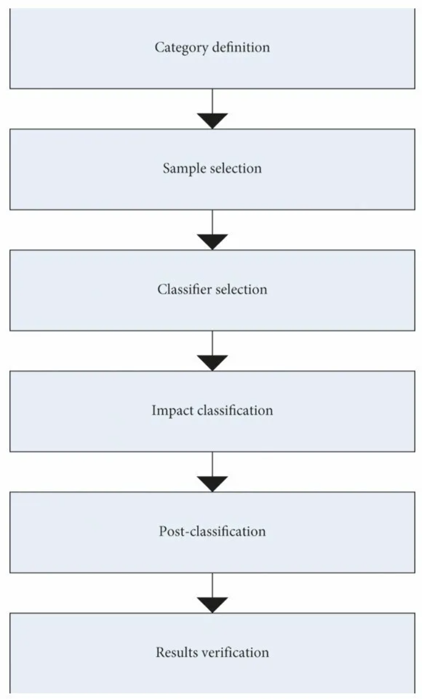
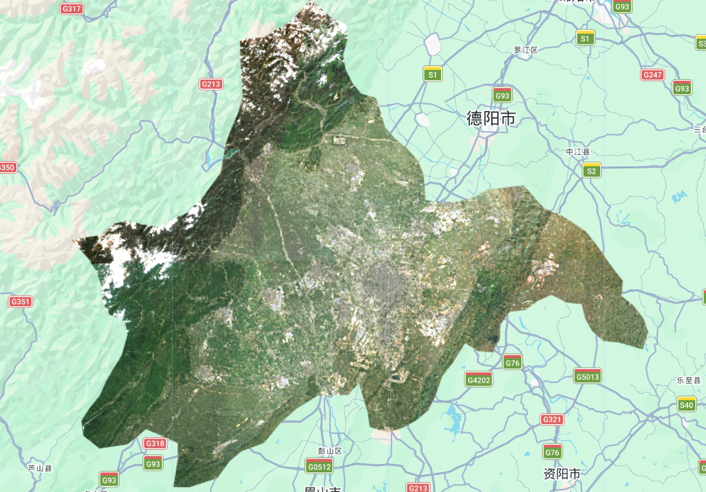
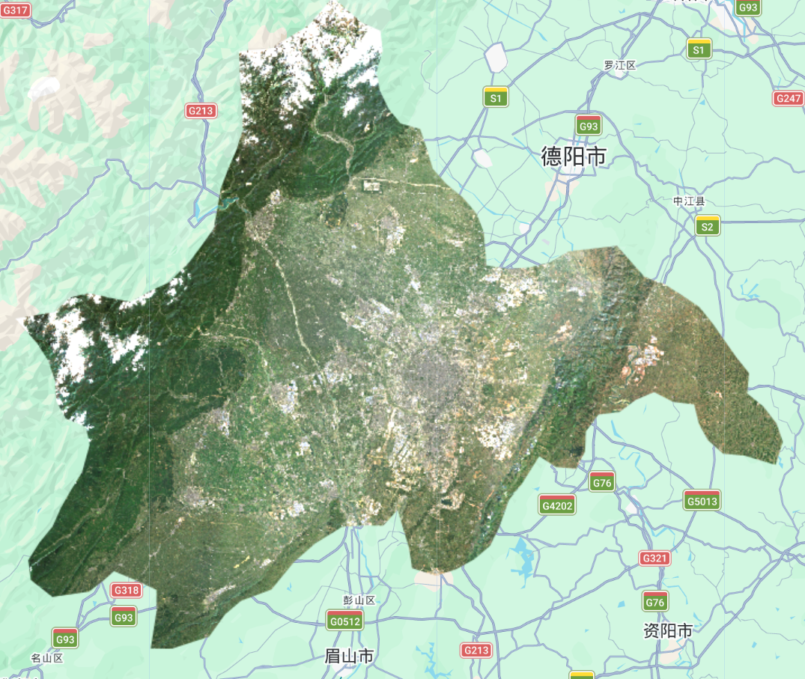
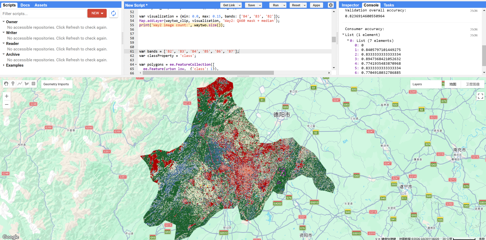

## 1. Content Summary

### 1.1 From Pixels to Labels: The Classification Framework

This week the focus shifted from **processing** satellite imagery to **interpreting** it — specifically, using supervised classification to assign every pixel a meaningful land cover category. The underlying concept is the **feature vector**: each pixel is described not by what it looks like visually, but by a row of numerical values across spectral bands, and this row becomes the input to a classifier [@jensen2015]. In Google Earth Engine, this translates to a **FeatureCollection** where each feature holds band reflectance values and a class label, forming the training data.

[@gisgeography2014] provides a useful practical overview, distinguishing two broad families:

* **Supervised classification** — the analyst provides labelled training samples; the algorithm learns a decision boundary from those labels and applies it to the entire image
* **Unsupervised classification** — the algorithm itself groups pixels by spectral similarity (e.g. *k*-means), and the analyst interprets the resulting clusters afterwards

GEE supports four supervised classifiers directly: **CART**, **Random Forest**, **Naïve Bayes**, and **SVM**. For this week's practical we focused on **CART** and **Random Forest**, both of which belong to the **decision tree** family [@jensen2015, Chapter 10].



### 1.2 Decision Trees, Ensembles, and the Random Forest Classifier

A **Classification and Regression Tree (CART)** partitions the feature space by repeatedly splitting on the band value that best separates classes, producing a binary tree of `if–then` rules. Each terminal node — a **leaf node** — holds a class prediction. The depth of the tree, number of nodes, and variable importance scores are all inspectable via `classifier.explain()` in GEE [@jensen2015].

**Random Forest** extends this by training many trees on **bootstrapped subsets** of the training data, with each split considering a random subset of bands. Predictions are aggregated by majority vote. Two properties make this useful:

1. **Out-of-Bag (OOB) error** — data not used to train any given tree is used to validate it, giving a free internal estimate of generalisation error without a separate hold-out set
2. **Reduced variance** — averaging across many trees cancels out the high variance of any individual tree

| Classifier | Handles Non-linearity | Interpretable | OOB Error | GEE Function |
|---|---|---|---|---|
| CART | Partially | ✓ (rules) | ✗ | `smileCart()` |
| Random Forest | ✓ | ✗ (ensemble) | ✓ | `smileRandomForest()` |
| Naïve Bayes | ✓ (with assumptions) | Partially | ✗ | `naiveBayes()` |
| SVM | ✓ | ✗ | ✗ | `libsvm()` |

: Comparison of GEE-supported supervised classifiers {#tbl-classifiers}

[@pal2005] specifically compare SVM against conventional classifiers for remote sensing, finding that **SVM often outperforms maximum likelihood** even with small training sets — a practically important point given that high-quality labelled imagery is expensive to generate.

### 1.3 Accuracy Assessment: The Error Matrix

Once a model is trained and applied, we need to quantify how well it performs. The standard tool is the **error matrix** (also called the confusion matrix), which cross-tabulates predicted labels against reference labels [@barsi2018]. From this matrix, several metrics can be derived:

$$
\text{Overall Accuracy (OA)} = \frac{\sum_{i=1}^{k} x_{ii}}{N}
$$

where $x_{ii}$ are the diagonal (correctly classified) counts and $N$ is the total number of test pixels.

Two class-level measures are critical:

* **Producer's accuracy** — of all pixels that *are* class $i$ in the reference data, what fraction did we correctly classify? (related to omission error)
* **Consumer's accuracy** (user's accuracy) — of all pixels we *predicted* as class $i$, what fraction truly belong there? (related to commission error)

[@barsi2018] argue that accuracy is multi-dimensional — it encompasses not just correctness but also **completeness**, **consistency**, and **timeliness** — and that the error matrix alone cannot capture all of these facets.

::: {.callout-important}
## Resubstitution vs. Validation Accuracy
**Resubstitution accuracy** applies the trained model back to its own training data — this will always be optimistically high. **Validation accuracy** uses a held-out test set the model has never seen. Only the latter gives a meaningful estimate of how the model will generalise to unseen imagery [@barsi2018].
:::

---

## 2. Applications of the Content

### 2.1 Workshop: Loading the Study Area

I chose **Chengdu** as my study area — it has a really nice mix of land cover types all within one administrative boundary: dense urban core, flat agricultural plains, river corridors, and mountain-edge forest on the western fringe. That variety should make it an interesting case for classification. Loading the study area meant filtering the FAO GAUL Level 2 dataset by `ADM2_CODE`, which for Chengdu is **13255**:

<details>
<summary>Show GEE code</summary>

```javascript
// --------------------- Load vector data --------------------------------
var dataset = ee.FeatureCollection("FAO/GAUL/2015/level2");
var chengdu = dataset.filter('ADM2_CODE == 13255');

Map.setCenter(104.065, 30.659, 9);
Map.addLayer(chengdu, {color: '00909F', fillColor: '00000000', width: 2}, 'Chengdu boundary');
```

</details>

One thing worth noting is that `ADM2_CODE` is a **numeric** field — no quotes around `13255`. Looking at Figure 2, the boundary is much larger than I expected. It covers not just the city proper but the surrounding counties under Chengdu's administrative jurisdiction, including the mountainous northwest. This matters for classification because it means the study area includes both dense city and remote mountain terrain — quite different environments that the model needs to handle simultaneously.


### 2.2 Workshop: Two Approaches to Cloud Handling

Chengdu is famously cloudy — it sits in the Sichuan Basin and locals joke that you rarely see blue sky. This made the cloud handling step particularly important. The workshop offered two strategies, and I ran both to see what the difference actually looks like in practice.

**Approach 1 — Low cloud cover threshold per tile:**

<details>
<summary>Show GEE code</summary>

```javascript
// --------------------- Approach 1: Low cloud cover --------------------------------
var divide10000 = function(image) {
  return image.divide(10000);
};

var wayone = ee.ImageCollection('COPERNICUS/S2_SR_HARMONIZED')
                  .filterDate('2022-01-01', '2022-10-31')
                  .filterBounds(chengdu)
                  .filter(ee.Filter.lt('CLOUDY_PIXEL_PERCENTAGE', 10));

var wayone_median = wayone.map(divide10000).median().clip(chengdu);

var visualization = {min: 0.0, max: 0.15, bands: ['B4', 'B3', 'B2']};
Map.addLayer(wayone_median, visualization, 'Way1: Low cloud filter');
print('Way1 image count:', wayone.size());
```

</details>

**Approach 2 — Pixel-level cloud masking using QA60 bitmask:**

<details>
<summary>Show GEE code</summary>

```javascript
// --------------------- Approach 2: QA60 cloud mask --------------------------------
function maskS2clouds(image) {
  var qa = image.select('QA60');
  var cloudBitMask = 1 << 10;   // Bit 10 = clouds
  var cirrusBitMask = 1 << 11;  // Bit 11 = cirrus
  var mask = qa.bitwiseAnd(cloudBitMask).eq(0)
      .and(qa.bitwiseAnd(cirrusBitMask).eq(0));
  return image.updateMask(mask).divide(10000);
}

var waytwo = ee.ImageCollection('COPERNICUS/S2_SR_HARMONIZED')
                  .filterDate('2022-01-01', '2022-10-31')
                  .filterBounds(chengdu)
                  .filter(ee.Filter.lt('CLOUDY_PIXEL_PERCENTAGE', 20))
                  .map(maskS2clouds);

var waytwo_clip = waytwo.median().clip(chengdu);
Map.addLayer(waytwo_clip, visualization, 'Way2: QA60 mask + median');
print('Way2 image count:', waytwo.size());
```

</details>

::: {.callout-note}
## Why Take the Median?
Even after pixel-level cloud masking, some artefacts remain. Taking the **median** across all images in the collection causes clouds — which have very high reflectance — to be pushed out of the middle of the distribution, leaving cleaner composite pixels [@gee_book2023, Chapter F2.1].
:::

::: {layout-ncol=2}



:::

*Figure 3: Comparing the two cloud-handling approaches over Chengdu. Both outputs share a visible brightness discontinuity where two satellite tiles meet — this suggests residual scene-to-scene differences that were not fully resolved by either cloud-handling strategy.*

Looking at the two outputs side by side, the differences are subtler than I expected. Both retain the diagonal **tile seam** where two Sentinel-2 scenes join. What stands out more to me is the northwest corner: there is clearly **snow on the mountain peaks**, which shows up as bright white. That became relevant later when I tried to classify the image.

### 2.3 Workshop: Drawing Training Data and CART Classification

This was the part of the practical that required the most judgement. I digitised **six land cover classes** as polygons directly on the composite image in GEE — low-albedo urban, water, high-albedo urban, grass, bare earth, and forest. For each class I picked areas that looked spectrally clean and unambiguous on the true-colour composite.

<details>
<summary>Show GEE code</summary>

```javascript
// --------------------- Training polygons --------------------------------
var polygons = ee.FeatureCollection([
  ee.Feature(urban_low,  {'class': 1}),
  ee.Feature(water,      {'class': 2}),
  ee.Feature(urban_high, {'class': 3}),
  ee.Feature(grass,      {'class': 4}),
  ee.Feature(bare_earth, {'class': 5}),
  ee.Feature(forest,     {'class': 6}),
]);

var bands = ['B2', 'B3', 'B4', 'B5', 'B6', 'B7'];
var classProperty = 'class';

var training = waytwo_clip.select(bands).sampleRegions({
  collection: polygons,
  properties: [classProperty],
  scale: 10
});

// --------------------- Train CART --------------------------------
var classifier = ee.Classifier.smileCart().train({
  features: training,
  classProperty: classProperty,
});

var classified = waytwo_clip.classify(classifier);
Map.addLayer(classified, {
  min: 1, max: 6,
  palette: ['d99282', '466b9f', 'ab0000', 'dfdfc2', 'b3ac9f', '1c5f2c']
}, 'CART classification');
```

</details>


The result (Figure 4) was more chaotic than I expected, and understanding why took some thought. The most obvious problem is that **red pixels (high-albedo urban) cover the entire northwestern mountain area**, which is visibly forested and snow-capped in the composite — clearly not urban. This is a fundamental spectral confusion issue: **fresh snow and high-reflectance rooftops can appear spectrally similar across the optical bands used here (B2–B7)**. The CART classifier simply cannot tell them apart because in the feature space they look the same [@jensen2015].

This is not something that can be fixed by drawing better training polygons. You could be absolutely precise about where you place `urban_high` samples — only on rooftops in the city centre — but the classifier will still assign that class to anything in the image with similar reflectance values, including snow. The only real solutions would be to either exclude winter imagery (so no snow), add **NIR or SWIR bands** where snow and built surfaces do differ, or incorporate a **DEM** to mask out high-elevation pixels before classification [@gisgeography2014].

### 2.4 Workshop: Pixel-Level Random Forest with Accuracy Assessment

Moving to Random Forest was meant to improve on CART by averaging across many trees. The code generates random sample points within each class polygon, splits them 70/30 for training and validation, and trains an ensemble classifier. One practical issue: running 100 trees with 1,000 points per class on a study area this size hit GEE's **memory limit**, so I reduced to 50 trees and 200 points per class to get it running:

<details>
<summary>Show GEE code</summary>

```javascript
// --------------------- Pixel-level sampling --------------------------------
var pixel_number = 200;

var urban_low_points  = ee.FeatureCollection.randomPoints(urban_low,  pixel_number).map(function(i){ return i.set({'class': 1}); });
var water_points      = ee.FeatureCollection.randomPoints(water,      pixel_number).map(function(i){ return i.set({'class': 2}); });
var urban_high_points = ee.FeatureCollection.randomPoints(urban_high, pixel_number).map(function(i){ return i.set({'class': 3}); });
var grass_points      = ee.FeatureCollection.randomPoints(grass,      pixel_number).map(function(i){ return i.set({'class': 4}); });
var bare_earth_points = ee.FeatureCollection.randomPoints(bare_earth, pixel_number).map(function(i){ return i.set({'class': 5}); });
var forest_points     = ee.FeatureCollection.randomPoints(forest,     pixel_number).map(function(i){ return i.set({'class': 6}); });

var point_sample = ee.FeatureCollection([
  urban_low_points, water_points, urban_high_points,
  grass_points, bare_earth_points, forest_points
]).flatten().randomColumn();

var split = 0.7;
var training_sample   = point_sample.filter(ee.Filter.lt('random', split));
var validation_sample = point_sample.filter(ee.Filter.gte('random', split));

var training   = waytwo_clip.select(bands).sampleRegions({collection: training_sample,   properties: ['class'], scale: 10});
var validation = waytwo_clip.select(bands).sampleRegions({collection: validation_sample, properties: ['class'], scale: 10});

// --------------------- Train & evaluate RF --------------------------------
var rf1_pixel = ee.Classifier.smileRandomForest(50).train(training, 'class');

var rf2_pixel = waytwo_clip.classify(rf1_pixel);
Map.addLayer(rf2_pixel, {
  min: 1, max: 6,
  palette: ['d99282', '466b9f', 'ab0000', 'dfdfc2', 'b3ac9f', '1c5f2c']
}, 'RF classification');

var validated    = validation.classify(rf1_pixel);
var testAccuracy = validated.errorMatrix('class', 'classification');
print('Validation error matrix: ', testAccuracy);
print('Validation overall accuracy: ', testAccuracy.accuracy());
print('Consumer accuracy: ', testAccuracy.consumersAccuracy());
```

</details>

::: {.callout-tip}
## Understanding the Three Accuracy Figures
When running the Random Forest, GEE reports three different accuracy numbers. **OOB error** comes from the RF's internal bootstrapping. **Resubstitution accuracy** re-applies the model to its own training data. **Validation accuracy** uses the held-out test set. Only the last one reflects real-world performance — and the difference between resubstitution and validation accuracy is a direct measure of **overfitting** [@barsi2018].
:::



| Class | Consumer Accuracy |
|---|---|
| urban_low | 84.1% |
| water | 83.3% |
| urban_high | 89.5% |
| grass | 77.4% |
| bare_earth | 83.3% |
| forest | 77.1% |
| **Overall** | **82.4%** |

: Random Forest validation accuracy by class {#tbl-accuracy}

The headline **82.4% overall accuracy** looks decent on paper, but the map output still looks fragmented in the same way as CART — the snow/urban confusion in the northwest is still there. This is an important thing to sit with: the accuracy figure only tells you how well the model performed on the test pixels, which were sampled from the same polygons as the training data. If those polygon areas are spectrally unrepresentative of the rest of the image, the number flatters the actual result. As [@barsi2018] put it, accuracy has multiple dimensions — internal consistency and external validity are not the same thing.

### 2.5 Literature Applications of Supervised Classification

[@jensen2015, Chapter 9] provides the theoretical grounding for these results — noting that the choice of training sample size, spatial distribution, and the **separability of spectral classes** all profoundly affect output quality. The Chengdu results illustrate this precisely: despite careful polygon placement, the spectral separability between classes was compromised by atmospheric effects.

At a practical research level, [@pal2005] demonstrated that **SVM outperforms maximum likelihood classification** with small training sets. Given the memory constraints encountered in this practical — which forced reduction to only 200 training points per class — SVM's sample efficiency advantage becomes practically relevant. [@gisgeography2014] surveys how classification techniques have evolved from simple parallelepiped methods towards ensemble and deep learning approaches, and [@barsi2018] argues that accuracy reporting in remote sensing literature is inconsistent, often reporting only overall accuracy while ignoring producer's and consumer's accuracy — exactly the kind of nuance that distinguishes a rigorous analysis from a superficial one.

![Figure 6: Example confusion matrix structure showing producer's accuracy (row-wise), consumer's accuracy (column-wise), and overall accuracy (diagonal sum). Source: based on [@barsi2018]](images/week7_confusion_matrix_diagram.png)

---

## 3. Personal Reflection

### 3.1 Snow Looks Like Rooftops, and That's a Real Problem

The thing that stuck with me most this week was the snow-urban confusion. I knew conceptually that high-albedo surfaces could cause misclassification, but seeing it play out so dramatically in the Chengdu results made it feel much more concrete. The classifier isn't doing anything wrong — it genuinely cannot distinguish between fresh snow and high-reflectance rooftops using the optical bands alone. They look identical in reflectance space. What this means in practice is that the accuracy number (82.4%) and the map quality are telling different stories. The accuracy comes from test pixels drawn from the same class polygons as the training data, all of which were located in the flat urban area where snow is not an issue. Out in the mountains, the model is confidently wrong, and the accuracy metric never captures that.

This connects to something [@barsi2018] argue quite forcefully: accuracy is not one thing. The error matrix captures a very specific kind of accuracy — whether the model's predictions match the reference labels on a held-out sample — but says nothing about spatial consistency, thematic completeness, or whether the classification makes geographic sense. I think this is worth being quite critical about in a research context: papers that report 90%+ accuracy on remote sensing classifications often do so on test data that isn't spatially independent from training data, which inflates the apparent performance.

Comparing CART and Random Forest was also interesting. Random Forest is supposed to reduce variance by averaging across many trees, but both outputs looked similarly fragmented here. That suggests the issue is upstream of the classifier — the spectral separability between classes is limited in these bands under Chengdu's atmospheric conditions. If I were doing this properly I'd probably want to add **SAR data** (which is not affected by haze) or **SWIR bands** where snow and built surfaces do diverge, before trying to classify [@schultetobuhne2018]. That feels like a more productive next step than tuning the classifier.

Looking further ahead, Chengdu's **Park City** initiative is a genuinely interesting application of this kind of workflow — trying to track whether green space is actually expanding alongside the city rather than just in policy documents. But the results this week are a reminder that getting a reliable land cover classification of Chengdu is harder than it looks, and the atmospheric problem would need to be addressed before you could trust any trend analysis built on top of it.

::: {.callout-warning}
## A Caution on Accuracy Figures in Atmospherically Challenging Regions
The overall accuracy of 82.4% only reflects performance on test pixels sampled from the same training areas — all in the flat urban zone where atmospheric haze is the main issue. In the mountain northwest, where snow causes severe spectral confusion with high-albedo urban surfaces, the classifier is confidently wrong and the accuracy metric never sees it. Always look at the map alongside the numbers [@barsi2018].
:::

---

## 4. References

::: {#refs}
:::
