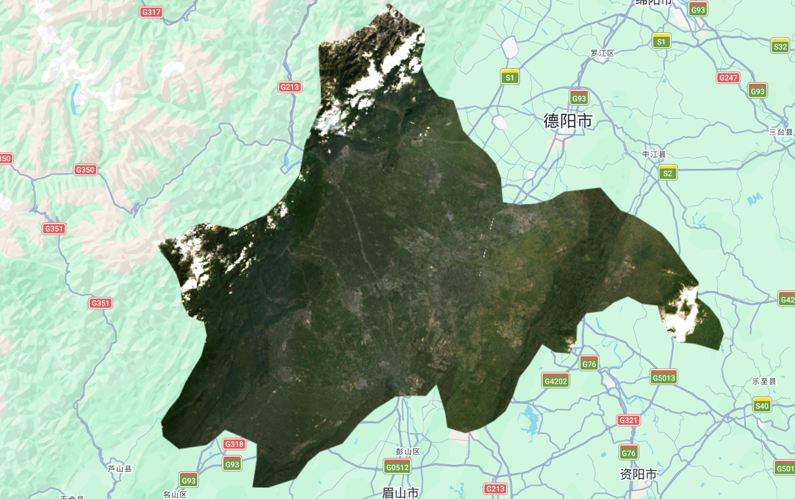
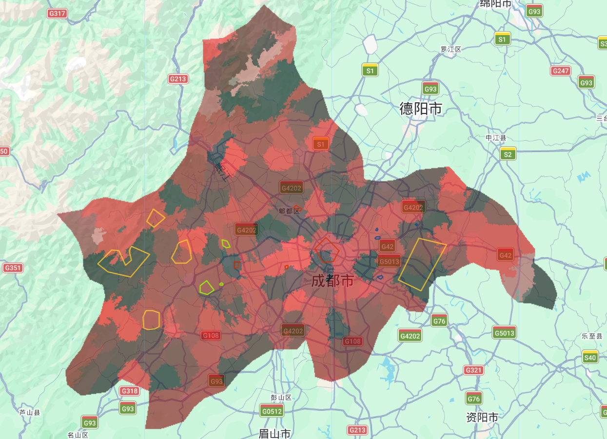

## 1. Content Summary

### 1.1 Beyond the Single-Class Pixel: Sub-pixel Spectral Unmixing

The lecture this week opened with a fundamental challenge to the assumption underlying last week's classification: that every pixel belongs to exactly one land cover class. At 30m Landsat resolution, this is almost never true. A pixel over an urban fringe area might simultaneously contain rooftop, road surface, vegetation, and shadow — and forcing it into a single category discards information that matters for urban density estimation, informal settlement mapping, or vegetation monitoring [@foody2004].

The solution introduced in the lecture is **linear spectral mixture analysis** (also called **spectral unmixing**), which models the observed pixel reflectance as a weighted sum of **endmember** spectra — spectrally pure reference signatures for each land cover type:

$$
\mathbf{r} = \sum_{i=1}^{n} f_i \cdot \mathbf{e}_i + \boldsymbol{\varepsilon}
\quad \text{subject to} \quad \sum_{i=1}^{n} f_i = 1, \quad f_i \geq 0
$$

where $\mathbf{r}$ is the observed pixel reflectance vector, $f_i$ is the **fractional abundance** of endmember $i$, $\mathbf{e}_i$ is its spectral signature, and $\boldsymbol{\varepsilon}$ is the residual error. The result per pixel is not a single label but a set of fractions — for instance, 55% urban, 30% vegetation, 15% bare soil [@jensen2015].

Two key choices determine the quality of the unmixing:

* **Endmember selection** — either defined manually from published spectral libraries, or derived from the image itself by extracting the mean reflectance within digitised training polygons
* **Constraints** — unconstrained unmixing can produce negative fractions or fractions summing to more than 1; applying **non-negativity** and **sum-to-one** constraints produces physically meaningful results [@foody2004]


### 1.2 Object-Based Image Analysis: From Pixels to Meaningful Objects

The second major concept from the lecture was **Object-Based Image Analysis (OBIA)** — a philosophy shift from classifying individual pixels to first grouping pixels into spatially and spectrally coherent **objects**, then classifying those objects. The lecture covered three approaches to creating these objects [@gee_book2023]:

1. **Image gradient** — detects edges by measuring directional change in intensity; useful for defining object boundaries but not sufficient alone
2. **Spectral gradient** — computes per-pixel differences between erosion (closest spectra) and dilation (furthest spectra), giving a measure of local spectral variability
3. **Superpixel segmentation** — groups pixels into compact objects by minimising within-object spectral variance; the main practical approach

The lecture's core argument for OBIA over pixel-based classification was that objects can carry **geometric and textural features** that single pixels cannot: shape, perimeter-to-area ratio, within-object standard deviation, and per-object NDVI. For urban mapping specifically, this is important because buildings, roads, and parks differ not just in mean spectral reflectance but in their spatial texture and internal variability [@matarira2023].

| Feature type | Pixel-based | OBIA |
|---|---|---|
| Mean spectral value | ✓ | ✓ |
| Within-object std dev | ✗ | ✓ |
| Shape / compactness | ✗ | ✓ |
| Per-object NDVI | ✗ | ✓ |
| Context (neighbour class) | ✗ | ✓ |

: Feature availability in pixel-based vs. OBIA classification {#tbl-features}

### 1.3 Superpixels: KMeans vs SNIC

The lecture introduced two superpixel algorithms used in GEE. Both start from a regular seed grid and grow clusters by minimising a distance measure, but they differ in how that distance is defined:

* **KMeans** — groups pixels by **spectral distance** only; clusters can span spatially discontinuous areas if they have similar reflectance; produces uniform square-ish objects
* **Simple Non-Iterative Clustering (SNIC)** — balances **spectral distance** and **spatial proximity** using a normalised combined metric; produces more naturally shaped objects that follow real-world feature boundaries; does not iterate, making it faster

The `compactness` parameter in SNIC controls this balance: high values produce regular grid-like objects (similar to KMeans), while low values allow objects to stretch along spectral edges. The lecture noted that for urban mapping, a lower compactness tends to produce more meaningful objects whose boundaries align with building edges and road networks.

### 1.4 The Spatial Dependence Problem in Accuracy Assessment

The third topic — arguably the most conceptually significant — came from [@karasiak2022] and directly challenges the accuracy figures from last week. The standard random train/test split (as used in week 7 with `randomColumn()`) does not guarantee spatial independence between training and validation data. If training and test pixels come from the same polygon — or from spatially adjacent areas — they are correlated due to **spatial autocorrelation**: nearby pixels tend to look similar regardless of the classifier.

::: {.callout-important}
## Why Random Splits Inflate Accuracy
[@karasiak2022] demonstrate that random train/test splits can inflate reported accuracy substantially, in some cases by around **10–20 percentage points** compared to spatially independent evaluation. The fix is **spatial cross-validation**: dividing the study area into spatial blocks and holding out entire blocks as test sets. This ensures the model is evaluated on genuinely unseen spatial territory, not just unseen pixels from the same neighbourhood as the training data.
:::

---

## 2. Applications of the Content

### 2.1 Workshop Overview and Processing Workflow

The workshop this week continues with **Chengdu** as the study area but switches the sensor to **Landsat 8** (30m resolution, 2022), which gives a coarser resolution than last week's Sentinel-2 but is a useful contrast — at 30m, mixed pixels are far more common, making sub-pixel unmixing particularly relevant. Three practical tasks follow in sequence: loading the Landsat 8 composite, running spectral unmixing and hardening the output, and segmenting the image with SNIC for OBIA classification.

### 2.2 Workshop: Loading Chengdu and Landsat 8

Continuing from week 7, the study area is still Chengdu filtered by `ADM2_CODE == 13255`. The key difference this week is the sensor — Landsat 8 Collection 2 requires a different scaling function from Sentinel-2, multiplying by `0.0000275` and adding `−0.2` rather than dividing by 10000. This brings raw integer DN values back to surface reflectance:

<details>
<summary>Show GEE code</summary>

```javascript
// --------------------- Vector: Chengdu --------------------------------
var dataset = ee.FeatureCollection("FAO/GAUL/2015/level2");
var chengdu = dataset.filter('ADM2_CODE == 13255');
Map.setCenter(104.065, 30.659, 9);
Map.addLayer(chengdu, {color: '00909F', fillColor: '00000000', width: 2}, 'Chengdu boundary');

// --------------------- Landsat 8 with scaling --------------------------------
function applyScaleFactors(image) {
  var opticalBands = image.select('SR_B.').multiply(0.0000275).add(-0.2);
  var thermalBands = image.select('ST_B.*').multiply(0.00341802).add(149.0);
  return image.addBands(opticalBands, null, true)
              .addBands(thermalBands, null, true);
}

var oneimage_study_area_cloud = ee.ImageCollection('LANDSAT/LC08/C02/T1_L2')
  .filterDate('2022-01-01', '2022-10-10')
  .filterBounds(chengdu)
  .filter(ee.Filter.lt("CLOUD_COVER", 1))
  .map(applyScaleFactors)
  .reduce(ee.Reducer.median())
  .select(['SR_B1_median','SR_B2_median','SR_B3_median',
           'SR_B4_median','SR_B5_median','SR_B6_median','SR_B7_median'])
  .clip(chengdu);

var vis_params = {bands: ['SR_B4_median','SR_B3_median','SR_B2_median'], min: 0.0, max: 0.3};
Map.addLayer(oneimage_study_area_cloud, vis_params, 'True Color (432)');
```

</details>

Comparing this Landsat 8 composite to last week's Sentinel-2 output immediately reveals the resolution difference — at 30m, individual buildings are no longer distinguishable, and the urban-rural fringe appears as a gradual blend rather than a sharp boundary. This is exactly the condition where sub-pixel unmixing adds most value: at 10m Sentinel-2 resolution, most pixels over the urban core are relatively pure; at 30m Landsat resolution, mixed pixels dominate the entire peri-urban zone. The QA pixel cloud mask was not applied here, as testing showed it incorrectly flags some high-reflectance mountain surfaces in the northwest — the same area that caused snow/urban confusion in last week's classification [@gee_book2023].

Unlike the Sentinel-2 composite from week 7 where snow-capped peaks were clearly visible in the northwest, the white areas in the Landsat 8 composite appear more consistent with residual cloud contamination than persistent snow cover, suggesting the median composite has partially suppressed the seasonal snow signal across the available eight scenes — though this would require further confirmation through QA masking or seasonal comparison. This means the snow/urban spectral confusion from week 7 is likely less prominent here, but may be replaced by a cloud/bare-earth confusion that similarly affects the unmixing results.



### 2.3 Workshop: Spectral Unmixing — Practical Implementation

The sub-pixel unmixing step is a direct practical application of the lecture theory on linear spectral mixture analysis. I digitised small polygons for four endmember classes in Chengdu — **urban**, **grass**, **bare earth**, and **forest** — reusing the same polygon locations from week 7 where possible, and used the image-derived approach to extract mean reflectance values as endmember spectra. One important adjustment: the Landsat 8 band naming after `.reduce(ee.Reducer.median())` appends `_median` to each band name, which needs to match the `reduceRegion` output keys:

<details>
<summary>Show GEE code</summary>

```javascript
// --------------------- Image-derived endmembers --------------------------------
function data_extract(image, vector) {
  var data = image.reduceRegion({
    reducer: ee.Reducer.mean(),
    geometry: vector,
    scale: 30,
    maxPixels: 1e8
  });
  return data.values();
}

var urban_data     = data_extract(oneimage_study_area_cloud, urban);
var grass_data     = data_extract(oneimage_study_area_cloud, grass);
var bare_earth_data = data_extract(oneimage_study_area_cloud, bare_earth);
var forest_data    = data_extract(oneimage_study_area_cloud, forest);

// --------------------- Constrained unmixing --------------------------------
var fractions_constrained = oneimage_study_area_cloud.unmix(
  [urban_data, grass_data, bare_earth_data, forest_data],
  true,  // sum to one
  true   // non-negative
);
Map.addLayer(fractions_constrained, {}, 'constrained fractions');
```

</details>

::: {.callout-note}
## Constrained vs. Unconstrained Unmixing
Without constraints, the solution can produce negative fractions or values summing to more than 1 — physically impossible. The two `true` arguments enforce **non-negativity** and **sum-to-one**, giving a result directly interpretable as proportional area coverage [@foody2004]. Running the unconstrained version first is useful for diagnostics: large negative values or totals far from 1 suggest a poorly chosen endmember.
:::

To produce a hard classification from the fractions (the "hardening" step described in the lecture), each fraction band is thresholded at 0.5:

<details>
<summary>Show GEE code</summary>

```javascript
// --------------------- Harden to single class --------------------------------
var reclassified_urban      = fractions_constrained.expression('b(0) > .5 ? 1 : 0');
var reclassified_grass      = fractions_constrained.expression('b(1) > .5 ? 2 : 0');
var reclassified_bare_earth = fractions_constrained.expression('b(2) > .5 ? 3 : 0');
var reclassified_forest     = fractions_constrained.expression('b(3) > .5 ? 4 : 0');

var reclassified_all = reclassified_urban
  .add(reclassified_grass)
  .add(reclassified_bare_earth)
  .add(reclassified_forest)
  .clip(chengdu);

Map.addLayer(reclassified_all, {
  min: 1, max: 4,
  palette: ['d99282', 'dfdfc2', 'b3ac9f', '1c5f2c']
}, 'hardened sub-pixel');
```

</details>


The 0.5 threshold is useful for producing an interpretable map, but it also collapses continuous abundance information back into discrete classes and may underrepresent highly mixed peri-urban pixels where no single endmember dominates — precisely the transitional zones where land use decisions are most consequential.

### 2.4 Workshop: SNIC Superpixel Segmentation and OBIA Classification

The OBIA workflow follows the lecture's core concept of first grouping pixels into spatially coherent objects before classifying them. I used a hexagonal seed grid with 40-pixel spacing and ran SNIC with `compactness = 1`, which allows objects to follow spectral edges rather than enforcing regular shapes. Using Chengdu at 30m Landsat resolution, the objects produced are noticeably larger and less detailed than they would be at Sentinel-2 resolution — each object represents a larger real-world footprint. These parameters were selected heuristically to balance object coherence and computational simplicity, rather than through formal optimisation.

<details>
<summary>Show GEE code</summary>

```javascript
// --------------------- SNIC segmentation --------------------------------
var seeds = ee.Algorithms.Image.Segmentation.seedGrid(40, "hex");

var snic = ee.Algorithms.Image.Segmentation.SNIC({
  image: oneimage_study_area_cloud,
  compactness: 1,
  connectivity: 8,
  neighborhoodSize: 50,
  seeds: seeds
});
Map.addLayer(snic, {}, 'SNIC objects', true, 0.6);

// --------------------- Per-object statistics --------------------------------
var clusters = snic.select('clusters');
var stdDev = oneimage_study_area_cloud
  .addBands(clusters)
  .reduceConnectedComponents(ee.Reducer.stdDev(), 'clusters', 100);

var NDVI = snic.normalizedDifference(['SR_B5_median_mean', 'SR_B4_median_mean']);

// --------------------- Build object feature image --------------------------------
var bands = ['SR_B1_median_mean','SR_B2_median_mean','SR_B3_median_mean',
             'SR_B4_median_mean','SR_B5_median_mean','SR_B6_median_mean','SR_B7_median_mean'];

var objectPropertiesImage = ee.Image.cat([
  snic.select(bands), stdDev, NDVI
]).float();

// --------------------- CART on object features --------------------------------
var points = ee.FeatureCollection([
  ee.Feature(urban,      {'class': 1}),
  ee.Feature(grass,      {'class': 2}),
  ee.Feature(bare_earth, {'class': 3}),
  ee.Feature(forest,     {'class': 4}),
]);

var training = objectPropertiesImage.sampleRegions({
  collection: points, properties: ['class'], scale: 30
});

var classifier = ee.Classifier.smileCart().train({
  features: training, classProperty: 'class',
});

var classified = objectPropertiesImage.classify(classifier);
Map.addLayer(classified, {
  min: 1, max: 4,
  palette: ['d99282', 'dfdfc2', 'b3ac9f', '1c5f2c']
}, 'OBIA classified');
```

</details>

::: {.callout-tip}
## What the Standard Deviation Feature Adds
Adding within-object standard deviation as a classification feature captures something the mean spectral value cannot: **internal variability**. A park object has low std dev across all bands — uniform grass. A dense urban block has high std dev — rooftops, roads, and shadow all within one object. The workshop notes exactly this: "a park might have a low standard deviation in the object, but an urban area might have a higher standard deviation." This is the key advantage of OBIA over pixel-based approaches [@gee_book2023].
:::




### 2.5 Literature: From Chengdu to Urban Mapping at Scale

The workshop methods connect directly to current research on urban mapping in rapidly growing cities. [@matarira2023] applied exactly this **OBIA-in-GEE** approach to map **informal settlements** in South Africa, fusing Sentinel-1 SAR, Sentinel-2, and PlanetScope data. Their key insight was that **textural features from SAR** — specifically backscatter intensity and coherence — were critical for separating informal settlements from formal housing, because corrugated iron rooftops and concrete rooftops can appear similar in **mean optical reflectance** alone. This is a direct extension of the standard deviation logic from the workshop: the within-object standard deviation captures structural variability that spectral means miss, and SAR adds a **structurally orthogonal** information source.

[@foody2004] provides the theoretical case for sub-pixel methods, arguing that the systematic error introduced by forcing mixed pixels into hard categories is largest at **land cover boundaries**. At 30m Landsat resolution over Chengdu, this is particularly relevant: the **peri-urban fringe** — where the city grades into agricultural land — is precisely where mixed pixels dominate and where land use decisions are most consequential for urban expansion monitoring. His chapter also makes a point about **endmember quality** that applies directly here: errors in a single endmember propagate as **systematic bias** across the entire unmixed image, which is why last week's snow/urban confusion would also affect sub-pixel results if mountain pixels were inadvertently included in the `urban_high` endmember polygon. Both [@barsi2018] and [@karasiak2022] push this critical thread further: [@barsi2018] argue that accuracy is **multi-dimensional**, and [@karasiak2022] demonstrate empirically that **spatial proximity** between training and test sets routinely overstates performance by margins large enough to affect real-world decisions.

---

## 3. Personal Reflection

### 3.1 Three Methods, One City, Very Different Assumptions

Working through **pixel-based classification** (week 7), **sub-pixel unmixing**, and **OBIA** in quick succession clarifies something that is easy to miss when each method is presented in isolation: they make fundamentally different assumptions about what a pixel represents. Pixel-based classification assumes each pixel is **pure**. Unmixing assumes it is a **linear mixture**. OBIA acknowledges that the pixel is the **wrong unit of analysis** altogether and tries to build something more meaningful before classifying.

For Chengdu at **30m Landsat resolution** — compared to the 10m Sentinel-2 used last week — the **mixed pixel problem** is much more severe. The peri-urban fringe where agricultural land grades into residential development is exactly the zone where Landsat pixels are most mixed and where planning decisions are most consequential. The sub-pixel approach is more honest about this than hard classification, but as [@foody2004] points out, validating **fractional abundance estimates** requires high-resolution reference data. OBIA partially sidesteps this by producing objects that can be validated with an error matrix, but the result is sensitive to **segmentation parameters** in ways that are difficult to optimise systematically.

The [@karasiak2022] finding recasts the **82.4% accuracy** from last week in an uncomfortable light. If training and validation pixels were **spatially proximate** — drawn from the same digitised polygons over Chengdu's flat urban zone — then the real accuracy on the mountain northwest may be substantially lower. The snow/urban confusion we saw in the CART output is consistent with exactly this **spatial limitation**. For a city government tracking Chengdu's **Park City** green space expansion using a land cover map, the gap between 82% on correlated pixels and a lower figure on genuinely independent spatial blocks is a practical problem, not just a statistical nuance.

Looking forward, [@matarira2023]'s **multi-sensor fusion** approach — combining SAR texture with optical classification — is the direction that would most directly address the problems encountered over both weeks. The atmospheric haze and snow confusion problems in Chengdu are **optical problems**; SAR is not affected by either, and adding **Sentinel-1 backscatter** as an additional feature in the OBIA pipeline would likely improve separability between the classes that optical bands struggle with.

::: {.callout-warning}
## Endmember Quality Is Everything in Spectral Unmixing
A poorly placed endmember polygon — for instance, one that contains shadow or mixed land cover — will produce a biased endmember spectrum that propagates systematic error across the entire unmixed image. Unlike standard classification where one bad training polygon affects only nearby pixels, in unmixing the error is global. [@foody2004] recommends collecting multiple small, spectrally pure polygons per class and averaging across them to reduce sensitivity to any single polygon location.
:::

---

## 4. References

::: {#refs}
:::
